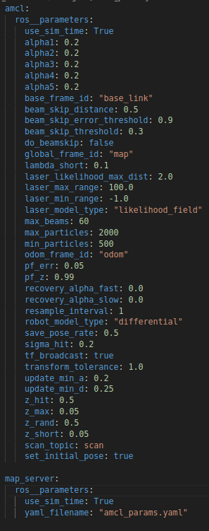

# AMCL (Adaptative Monte Carlo Localization) in ROS2

The **amcl** package is a Particle Filter-based localization node (Monte Carlo Localization - MCL) used to estimate the robot's position within a previously known map. It combines sensor sequences, such as Lidar and odometry, to continuously update the robot's pose estimate, enabling accurate intelligent navigation. AMCL is widely used in ROS2 in mobile robot applications, as it allows compensating for accumulated errors in odometry and dealing with uncertainties in the robot's initial position in the environment.

## 1. Package configuration file

Since we are still dealing with the localization problem, we will use the same package created in the last lesson to organize the configuration files and start the package.

1. Inside the ```config``` directory, create the ``amcl_params.yaml``` file

2. In the file, copy the following configuration code:



### Code explanation

This file is divided into two main declarations: ```amcl``` and ```map_server```.

- ```map_server``` -> This section contains the configurations of the ```map_server``` package, it will be responsible for reading the map from our environment and publishing it to the ```/map``` topic.

- ```amcl```-> This section will contain the configuration settings for the AMCL (Adaptive Monte Carlo Localization) package, which can be seen in more detail [in this link](https://docs.nav2.org/configuration/packages/configurando-amcl.html).

## 2. Using the Map

As seen during the class, the **AMCL** algorithm uses a predefined map of its environment as a global localization reference. In the following classes we will understand how to build a map, but for now we will use a ready-made one to apply the algorithm.

1. **Add the map to the package**

- In the ```rm_localization``` package, create a new directory called ```map```

- Copy the ``my_map.pgm``` and ```my_map.yaml``` files, available on blackboard, to this directory.

- The ```my_map.pgm``` file is an image format containing the map, where black pixels represent occupied areas (with obstacles), white pixels represent free areas, and gray pixels represent unknown areas.

- The ```my_map.ymal``` file will contain information about the map image, such as resolution and which size of each pixel corresponds to real life.

- Add the new directory to the path of files to be installed by ```CMakeLists.txt```.

2. **Open corresponding world**

This map was made using the map available in the ```robot_description``` package placed in Blackboard. If this is not the world you are using, download the world and place it inside your own package. Remember to indicate that it will be opened in the **Gazebo** ```Launch File```.

## 3. Launch File

Copy the ```amcl.launch.py``` file into the ```launch``` directory. This file will start the following nodes:

- ```amcl```: Responsible for the probabilistic localization of the robot on the map using the Particle Filter (Monte Carlo Localization - MCL). It receives Lidar and odometry data, calculates the most probable position of the robot and dynamically adjusts the number of particles to optimize localization accuracy.

- ```map_server```: Loads and makes available the environment map to the other ROS2 nodes. AMCL needs this map to compare Lidar readings and determine the robot's position. The map is provided in the Occupancy Grid format (occupied/free cells).

- ```lyfecycle_manager```: Manages the life cycle of the system nodes (e.g. amcl, map_server). Controls the initialization and status of the nodes, ensuring that they only start operating when all the necessary components are ready.

## 4. Test

1. Compile your workspace and update the environment.

2. In a first terminal, open your simulation.

3. In another terminal, run ```ekf_node``` using the launch file created in the last lesson.

4. In a third terminal, run the newly created launch file, which should initialize the **map** and the ```amcl``` package to control the robot.

5. In Rviz, add two views, the map, subscribing to the ```/map``` topic, and the view of the particles created by the algorithm.

6. Navigate with the robot and see how the particles and the filter behave.

7. Change the following parameters in the ```amcl``` package configuration file:

- ```min_particles```: Minimum number of particles kept in the system. If the robot is well localized, AMCL can reduce the number of particles to save processing.

- ```max_particles```: Maximum number of particles that can be used. If there is a lot of uncertainty in the position, AMCL can increase the number of particles to improve accuracy.

- ```update_min_a``` **(Angular update threshold)**: Defines the minimum rotation (in radians) that the robot needs to perform before AMCL updates the particles.

- ```update_min_d``` **(Linear update threshold)**: Defines the minimum distance (in meters) that the robot needs to travel before AMCL updates the particles.

Evaluate how changing these parameters influences the quality of localization and processing time.

8. Now, for the most extreme case, pause navigation and manually move your robot within its environment. Restart navigation with it and see if it is able to locate itself again.