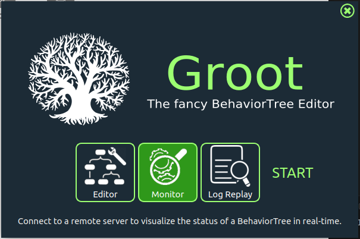
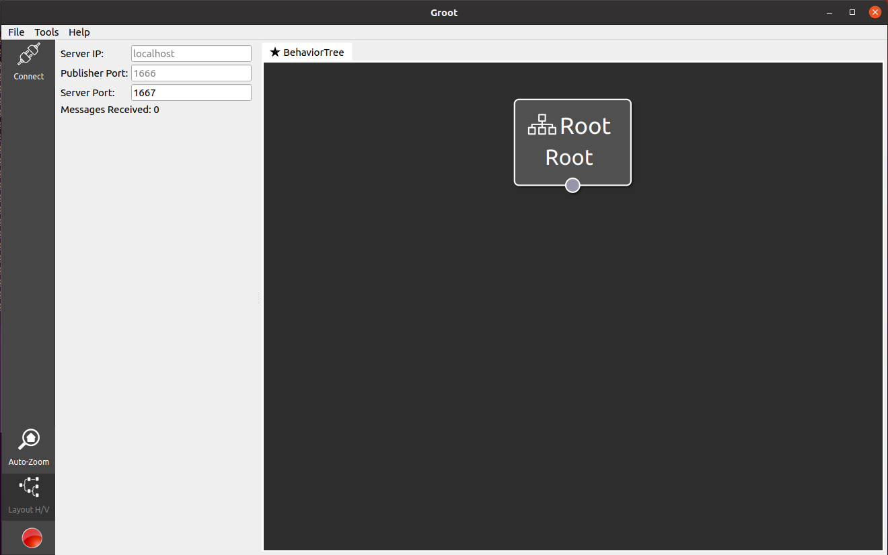
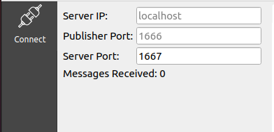
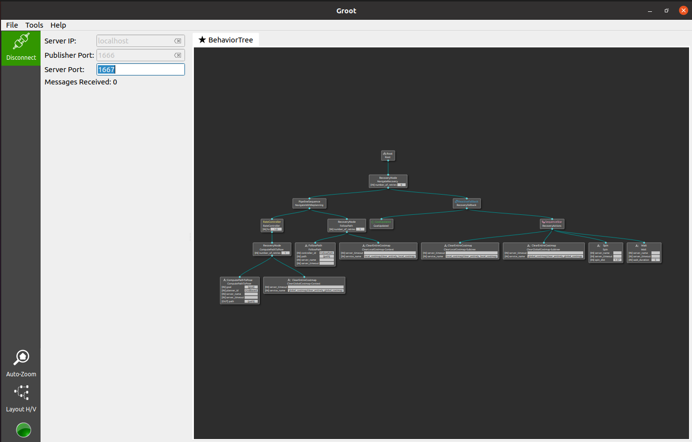
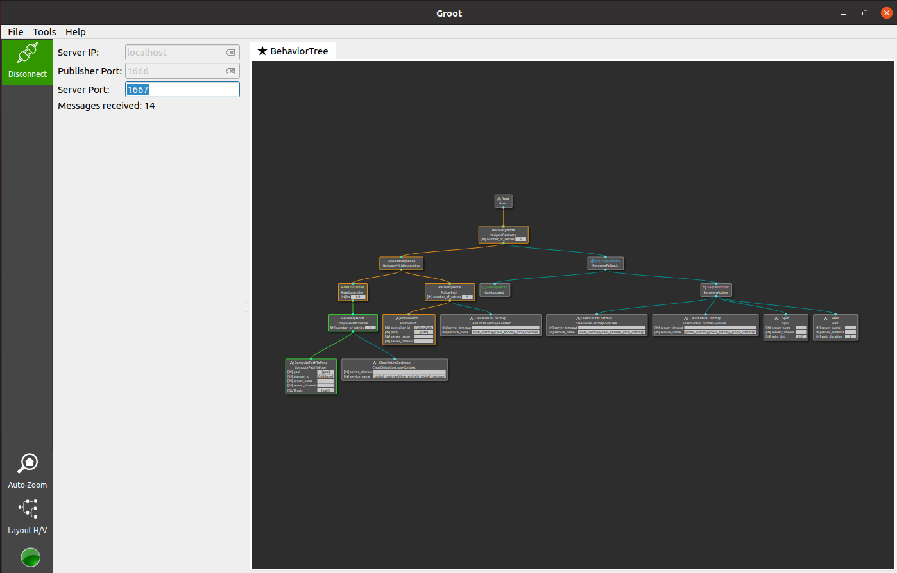

# Behavior Trees

The goal of this exercise will be to understand and visualize how the **Behavior Tree** used for navigation with **Nav2** works. The **Groot** software will be used to perform the visualization.

Next, you will modify the default **Behavior Tree** used by **Nav2** to add new behaviors.

## 1. Groot Installation

The first step will be to install **Groot**. This is a program used to analyze **Behavior Trees** in any context, but it has direct integration with ROS2.

1. **Clone the repository**

    In a terminal, enter the repository where you want to install the program (for example, ```home```) and clone the ```Groot``` repository:

    ```bash
    cd ~
    git clone --recurse-submodules https://github.com/BehaviorTree/Groot.git
    ```

2. **Install required dependency**
    ```bash
    sudo apt update
    sudo apt-get install libqt5svg5-dev
    ```

3. **Run the compilation and build of the code**

    ```bash
    cd Groot
    cmake -S . -B build
    cmake --build build
    ```

4. **Open the program**

    To start the program, you must enter the ```build``` directory and run ```Groot```:

    ```bash
    cd build
    ./Groot
    ```

    When executed, the following screen should open:

    

    From the options, select ```Monitor``` and click ```start```, the following page should open:

    

    This is the **Behavior Trees** view.

## 2. Viewing the Behavior Tree

1. **Start the Turtlebot3 simulation**

    ```bash
    ros2 launch nav2_bringup tb3_simulation_launch.py params_file:=/path/to/your/config/file.yaml
    ```

    Remember to define an estimate of the robot's initial position.

2. **Establish a connection between ```Groot``` and ```Nav2```**

    In the top left corner of the groot home screen, click ```Connect```. If the ```Server Ip```, ```Publisher Port``` and ```Server Port``` fields are not filled in with default values, fill them in according to the image below.

    

    If the connection to **ROS2** is successful, you should now be able to view the Behavior Tree structure.

    

3. **Send a waypoint to Nav2**

    Using the ```Rviz``` interface send a navigation command. Once the robot is navigating, go back to ```Groot```, you should see something like below:

    

    Note that the lines referring to the "branches" of the tree being executed can assume the following colors:

    - Green: The action was executed and returned **success**

    - Yellow: The action is in execution

    - Red: The action was finalized returning **failure**

## 3. Comparison with XML file

Behavior Trees are written, like URDF files, in an XML format. Below is the default **Behavior Tree** used by **Nav2**:

```xml
<root main_tree_to_execute="MainTree">
  <BehaviorTree ID="MainTree">
    <RecoveryNode number_of_retries="6" name="NavigateRecovery">
      <PipelineSequence name="NavigateWithReplanning">
        <RateController hz="1.0">
          <RecoveryNode number_of_retries="1" name="ComputePathToPose">
            <ComputePathToPose goal="{goal}" path="{path}" planner_id="GridBased"/>
            <ClearEntireCostmap name="ClearGlobalCostmap-Context" service_name="global_costmap/clear_entirely_global_costmap"/>
          </RecoveryNode>
        </RateController>
        <RecoveryNode number_of_retries="1" name="FollowPath">
          <FollowPath path="{path}" controller_id="FollowPath"/>
          <ClearEntireCostmap name="ClearLocalCostmap-Context" service_name="local_costmap/clear_entirely_local_costmap"/>
        </RecoveryNode>
      </PipelineSequence>
      <ReactiveFallback name="RecoveryFallback">
        <GoalUpdated/>
        <SequenceStar name="RecoveryActions">
          <ClearEntireCostmap name="ClearLocalCostmap-Subtree" service_name="local_costmap/clear_entirely_local_costmap"/>
          <ClearEntireCostmap name="ClearGlobalCostmap-Subtree" service_name="global_costmap/clear_entirely_global_costmap"/>
          <Spin spin_dist="1.57"/>
          <Wait wait_duration="5"/>
        </SequenceStar>
      </ReactiveFallback>
    </RecoveryNode>
  </BehaviorTree>
</root>
```

Compare the **Behavior Tree** seen in the **Groot** program with its corresponding **XML** structure.

**Nav2** uses an open source behavior tree library called **BehaviorTree.CPP**; its documentation and more details about the nodes can be found [at this link](https://www.behaviortree.dev/docs/3.8/intro). In addition, **ROS2** implements custom nodes to facilitate common structures in robotics applications, which can be found [at this link](https://docs.nav2.org/configuration/packages/configuring-bt-xml.html)
