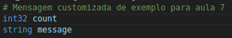
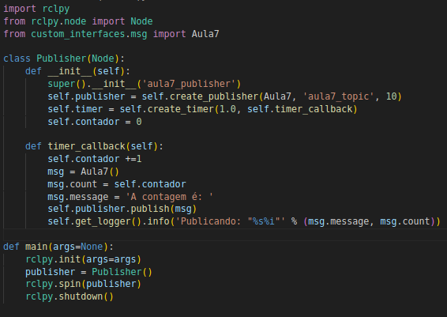
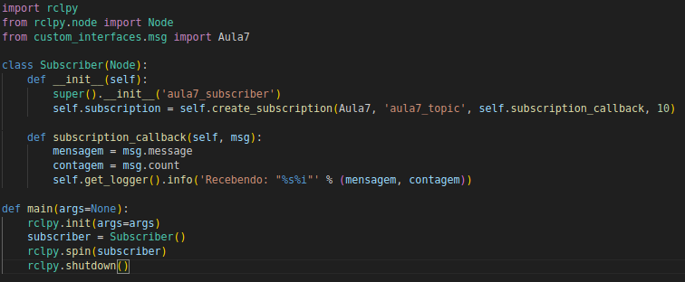

# Custom Messages, Publishers and Subscribers

In this exercise, you will:

- Create a ROS2 workspace;
- Create a package for custom interfaces.
- Create a package for the nodes in Python.
- Write two nodes: a publisher and a subscriber, using the custom message.
- (Extra Exercise) Publish velocities in cmd_vel and read odometry in /odom.

## 1. Create a ROS2 workspace 

1. Choose a directory on your machine to create your workspace. In the example, we will use ~/aula7_ws, but you can use another if you prefer.

2. In the terminal, create the directory and the src folder inside it:

    ```bash
    mkdir -p ~/aula7_ws/src
    cd ~/aula7_ws
    ```

- In ROS2, the concept of **workspace** is used to organize packages and compile the code using ```colcon build```.

- The ```src``` folder is the default directory where ROS2 packages should be placed inside the **workspace**.

## 2. Copy the ```custom_interfaces``` package

In the ```.zip``` file of the lesson, you will find the ```custom_interfaces``` package. This package will be responsible for defining and grouping the custom interfaces that you need for this exercise. It has the following structure:

```css
    custom_interfaces
    ├── package.xml
    ├── CMakeLists.txt
    └── msg
        └── (pasta para arquivos .msg)
```

In it, the ```CMakeLists.txt``` and ```package.xml``` files already have the dependencies configured for the installation of custom interfaces for ROS2. In the ```msg``` directory, the custom action interfaces will be placed, which have the ```.msg``` extension.

1. Copy the ```custom_interfaces``` package provided to inside ```~/aula7_ws/src```. At the end, the structure of your workspace should look like this:

    ```css
    ros2_ws
    └── src
        ├── custom_interfaces
        │   ├── package.xml
        │   ├── CMakeLists.txt
        │   └── msg
        │       └── ...
    ```

## 3. Create a custom service interface

1. Inside the ```msg``` directory of the ```custom_interfaces``` package, create a file called ```Aula7.msg```
    - Normally, the names of interfaces are written together with all the names, with the first letter of each name in uppercase and ending with the extension of the type of interface, for example: ```CustomMessage.msg```

2. Add the following content to the file:

    

    The message interface is composed of the information you want to transport, being defined by the type of message (int64, float32, string, etc) and by the name of the variable that will store the information.

    In this case, the message will be composed of:
    - ```count```: of type ```int32```
    - ```message```: of type ```string```

3. In the ```CMakeLists.txt``` file, declare the newly created interface to be installed:

    ```bash
    rosidl_generate_interfaces(${PROJECT_NAME}
        "msg/Aula7.msg"
    )
    ```

## 4. Compile the ```custom_interfaces``` package

Now we will compile the workspace so that ROS2 generates the definitions of this new message.

1. In the terminal, inside ```~/aula7_ws```, execute:

    ```bash
    colcon build
    ```

2. Then, update the environment:

    ```bash
    source install/setup.bash
    ```

3. Check if the interface is available. In the terminal, execute:

    ```bash
    ros2 interface list
    ```

    And see if the new interface created is among the available ones

    Now, see if the interface corresponds to the one created:

    ```bash
    ros2 interface show custom_interfaces/msg/Aula7
    ```

## 5. Create a new Python ROS2 package

We will create a new **python** ROS2 package, inside the ```~/aula7_ws/src``` directory, to create the nodes for this lesson. 

1. In the terminal, type:

```bash
cd ~/aula7_ws/src
ros2 pkg create aula7 --build-type ament_python --dependencies rclpy custom_interfaces
```

This command will create a new package called ```aula7```. The argument ```--build-type ament_python``` will define the package structure as python. The argument ```--dependencies rclpy custom_interfaces``` automatically adds the indicated dependencies to the ```package.xml``` file.

2. The created package must contain the following structure:

    ```css
    aula7
    ├── package.xml
    ├── setup.py
    ├── resource
    │   └── aula7
    ├── setup.cfg
    └── aula7
        ├── __init__.py
    ````

The nodes will be created in the package's homonymous directory, in this case ```aula7/aula7/```.

## 4. Creating a Publisher

We will create a Python script (**Node**) that will contain a **Publisher**. It will be responsible for publishing (sending) the message to the topic.

1. In the ```aula7/aula7``` directory, create a file called ```publisher.py``` and copy the code below.




### Explanation of the code

The code defines a ROS2 node that publishes messages periodically to a topic called **aula7_topic**. It creates and sends messages of type **Aula7**, containing a counter that increments by one every second.

**1. Imports**

```python
import rclpy
from rclpy.node import Node
from custom_interfaces.msg import Aula7
```

- ```rclpy```: Main ROS2 library for Python.

- ```rclpy.node.Node```: Base class to create ROS2 nodes.

- ```custom_interfaces.msg.Aula7```: Import the custom message **Aula7**, which contains the fields defined in the ```.msg``` file.

**2. Definition of the Publisher Node**

```python
class Publisher(Node):
    def __init__(self):
        super().__init__('aula7_publisher')
        self.publisher = self.create_publisher(Aula7, 'aula7_topic', 10)
        self.timer = self.create_timer(1.0, self.timer_callback)
        self.contador = 0
```

- ```class Publisher(Node)``` → Creates a class called Publisher, which inherits from Node, making it a ROS2 node.

- ```super().__init__('aula7_publisher')``` → Initializes the node with the name 'aula7_publisher'.

- **Creation of the Publisher**:

    - ```self.create_publisher(...)``` → Creates a publisher to send messages of type ```Aula7``` to the topic ```aula7_topic```.
	
    - ```10``` → Defines the size of the message queue of undelivered messages.

- ```self.create_timer(1.0, self.timer_callback)``` → Configures a timer that calls the ```timer_callback``` function every 1 second.

**3. Timer Callback**

```python
def timer_callback(self):
        self.contador +=1
        msg = Aula7()
        msg.count = self.contador
        msg.message = 'A contagem é: ' 
        self.publisher.publish(msg)
        self.get_logger().info('Publicando: "%s%i"' % (msg.message, msg.count))
```

- **Create a new message of type Aula7**:

    ```python
    msg = Aula7()
    ```
    - Instances an object of type Aula7.

- **Define the values of the message**:

    ```python
    msg.count = self.contador
    msg.message = 'A contagem é: '
    ```

    - The count field receives the updated value of the counter.

	- The message field receives a fixed text.
    
- **Publish the message**:

    ```python
    self.publisher.publish(msg)
    ```

    - Sends the message to the topic aula7_topic.

**4. Main Function (```main```)

```python
def main(args=None):
    rclpy.init(args=args)
    publisher = Publisher()
    rclpy.spin(publisher)
    rclpy.shutdown()
```

- **Initialize ROS2**:

    ```python
    rclpy.init(args=args)
    ```
    - Prepara o ROS2 para rodar.

- **Create an instance of the node**:

    ```python
    publisher = Publisher()
    ```

- **Keeps the node running**:

    ```python
    rclpy.spin(publisher)
    ```

- **Finalizes the node when it is interrupted**:

    ```python
    rclpy.shutdown()
    ```

### Summary

1.	The publisher node (Publisher) is created.

2.	Every 1 second, it:

    - Increments the counter.
	
    - Creates and publishes a message with the count on the topic aula7_topic.
	
    - Displays the message in the log.
	
3.	The node remains running until it is interrupted.

## 5. Run the node with the publisher

1. Before running, edit the ```setup.py``` file inside ```aula7```, to register this script as executable. Add in entry_points:

    ```python
    entry_points={
        'console_scripts': [
            'publisher = aula7.publisher:main',
        ],
    },
    ```

    This step is necessary whenever a new node is created. The command is structured as follows:
        
     - ```publisher```: Name that will be used to execute the script

     - ```aula7```: Name of the package

     - ```publisher```: Name of the python script to be registered

     - ```:main```: Function of the script that will be executed

2. In a terminal, go back to the root directory of the workspace ```~/aula7_ws```, compile again and update the environment:

    ```bash
    colcon build
    source install/setup.bash
    ```

3. Now, execute the service

    ```bash
    ros2 run aula7 publisher
    ````

## 6. Check if the publisher is running by the terminal

1. In a new terminal, without interrupting the previous one, update the environment with ```source install/setup.bash```

2. List the active nodes:

    ```bash
    ros2 node list
    ```

    You should see ```/aula7_publisher``` among the listed nodes

3. See what is the type of the created publisher interface:

    ```bash
    ros2 action type /aula7_publisher
    ```

    This command should return ```custom_interfaces/msg/Aula7```

4. See what is being published in the topic ```aula7_topic``` by the terminal:

    ```bash
    ros2 topic echo /aula7_topic
    ```

## 7. Creating a subscriber

The process of creating a **subscriber** is very similar to that of a **publisher**. It will be responsible for receiving messages published on a topic.

1. In the ```aula7/aula7``` directory, create a file called ```subscriber.py``` and copy the code below.



### Explanation of the code

The code defines a node with a **subscriber** that receives messages from a topic called **aula7_topic**. It listens to messages of type **Aula7** and displays the received values in the terminal.

**1. Imports**

```python
import rclpy
from rclpy.node import Node
from custom_interfaces.msg import Aula7
```

- ```rclpy```: Main library for ROS2 in Python.

- ```rclpy.node.Node```: Base class to create ROS2 nodes.

- ```custom_interfaces.msg.Aula7```: Import the custom message **Aula7**, which contains the fields defined in the ```.msg``` file.

**2. Definition of the Subscriber Node**

```python
class Subscriber(Node):
    def __init__(self):
        super().__init__('aula7_subscriber')
        self.subscription = self.create_subscription(Aula7, 'aula7_topic', self.subscription_callback, 10)
```

- ```class Subscriber(Node)``` → Creates a class called Subscriber, which inherits from Node, making it a ROS2 node.

- ```super().__init__('aula7_subscriber')``` → Initializes the node with the name 'aula7_subscriber'.

- **Creation of the Subscriber**:

    - ```self.create_subscription(...)``` → Creates a subscriber that:
	
        - Listens to messages of type ```Aula7```.
	    
        - Subscribes to the topic ```aula7_topic```.
	    
        - Executes the ```self.subscription_callback``` function whenever a new message is received.
	
        - Uses a queue size of ```10```, meaning it can store up to 10 messages before processing them.

**3. Subscriber Callback**

```python
def subscription_callback(self, msg):
    mensagem = msg.message
    contagem = msg.count
    self.get_logger().info('Recebendo: "%s%i"' % (mensagem, contagem))
```

- ```def subscription_callback(self, msg)```: → Function called whenever the node receives a message on the topic ```aula7_topic```. The received message is stored in the ```msg``` variable.

- **Reads the values of the received message**:

    ```python
    mensagem = msg.message
    contagem = msg.count
    ```

**4. Main Function (```main```)**

```python
def main(args=None):
    rclpy.init(args=args)
    subscriber = Subscriber()
    rclpy.spin(subscriber)
    subscriber.destroy_node()
    rclpy.shutdown()
```

- **Initializes ROS2**:

    ```python
    rclpy.init(args=args)
    ```
    - Prepara o ROS2 para rodar.

- **Creates an instance of the node**:

    ```python
    subscriber = Subscriber()
    ```

- **Keeps the node running**:

    ```python
    rclpy.spin(subscriber)
    ```

- **Finalizes the node when it is interrupted**:

    ```python
    rclpy.shutdown()
    ```

### Summary

1.	The Subscriber is created and subscribes to the topic ```aula7_topic```.

2.	When a new message is published on that topic:

    - The subscription_callback function is called.
	
    - The message is read and its values are stored.
	
    - The data is displayed in the terminal.
	
3.	The node remains running until it is interrupted.

## 8. Run the node with the subscriber

1. Before running, edit the ```setup.py``` file inside ```aula7```, to register this script as executable. Add in entry_points:

    ```python
    entry_points={
        'console_scripts': [
            'publisher = aula7.publisher:main',
            'subscriber = aula7.subscriber:main',
        ],
    },
    ```

    This step is necessary whenever a new node is created. The command is structured as follows:
        
     - ```subscriber```: Name that will be used to execute the script

     - ```aula7```: Name of the package

     - ```subscriber```: Name of the python script to be registered

     - ```:main```: Function of the script that will be executed

2. In a terminal, go back to the root directory of the workspace ```~/aula7_ws```, compile again and update the environment:

    ```bash
    colcon build
    source install/setup.bash
    ```

3. Now, execute the node

    ```bash
    ros2 run aula7 subscriber
    ````

## 9. Check if the subscriber is running by the terminal

1. In a new terminal, without interrupting the previous one, update the environment with ```source install/setup.bash```

2. List the active nodes:

    ```bash
    ros2 node list
    ```

    You should see ```/aula7_subscriber``` among the listed nodes

3. Run the publisher node again:

    ```bash
    ros2 run aula7 publisher
    ```

4. Now you should see the subscriber receiving the messages sent by the publisher and printing them in the terminal.

5. In a third terminal, open ```rqt_graph``` and see the communication between the nodes.

## 6. Fixation exercise

In this exercise we will apply the knowledge acquired during the class in a more real application, interacting with the simulation developed in the last classes.

### Objective

Create a node that makes the simulated differential robot repeat a square of 5m side, for this, the node should subscribe to the ```/odom``` topic and publish on the ```/cmd_vel``` topic.

### Steps

- Create a new package called ```ros_exercises``` in the same directory of ```robot_description```.

- In ```ros_exercises``` create the node ```square.py```.

- Compile and test the code

### Tips

- Always remember to load the environment variables when compiling the code or opening a new terminal.

- Do not forget to configure the ```package.xml``` and ```setup.py``` files

- Do not try to make the entire node at once, this makes debugging difficult. Add and test the code part by part, checking if the result is as expected.
