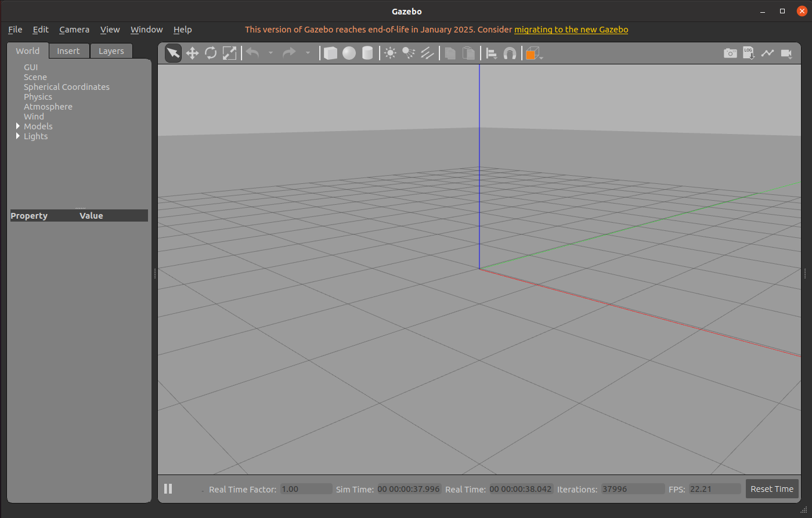
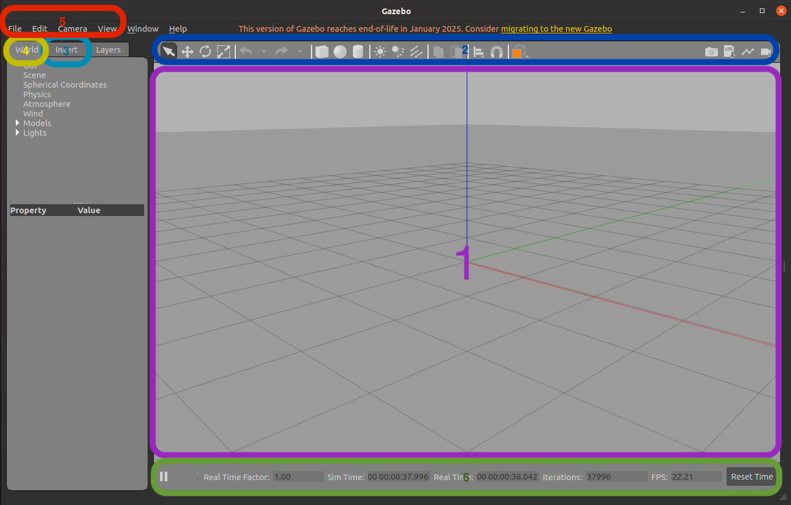
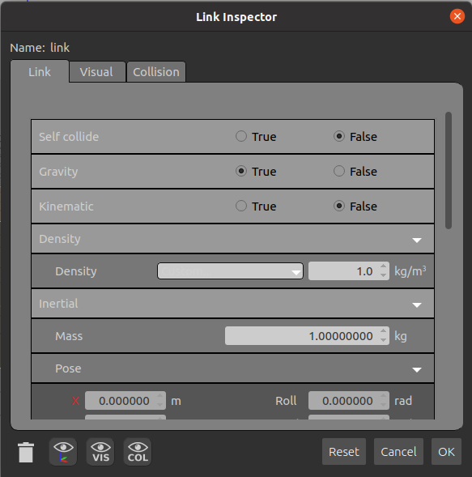
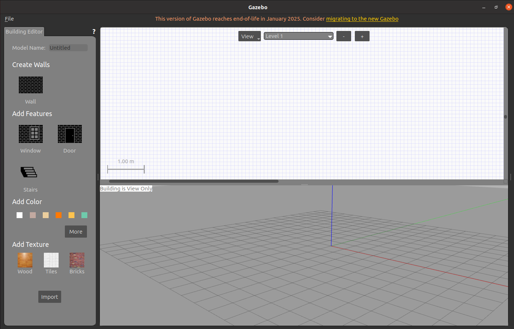

# Gazebo Basics

## Goals
- Getting to know the Gazebo Classic 11 interface;
- Insert and manipulate simple elements in the simulation;
- Explore the Model Editor to modify model properties;
- Use the Build Editor to create complete environments;
- Perform a practical activity: create a house with elements (walls, doors, windows, roof).

## 1. Exploring the Gazebo Interface

### 1.1 Starting Gazebo 

1. Open the terminal and type the following command to start Gazebo:
    ```bash
    gazebo
    ```

2. Wait until the main window is loaded.

    

### 1.2 Componentes Principais da Interface

1. **3D View:** Where the simulation is rendered in real time.

2. **Toolbar:** Usually located at the top, with icons for inserting, moving, rotating and scaling elements.

3. **Insert Panel:** Usually located on the side, where you can choose models and objects to insert into the simulation.

4. **World Panel:** Displays information about the models present in the world (list of objects, properties, etc.).

5. **Menus:** At the top, with options like File, Edit, Tools, etc.

6. **Simulation Bar:** Where simulation data is presented, such as simulation time, FPS, start/pause button, reset button.



### Activity 1

1. **Navigate the 3D window:** Use the mouse to move the camera (click and drag) and the scroll to zoom in or out.

2. **Explore the panels:** Click on each item in the toolbar and observe the available options. 

## 2. Adding and Moving Simple Elements

### 2.1 Inserting Elements

1. In the **Insert** panel, select a simple element, such as a **cube** or a **sphere**.

2. Click and drag the model to the simulation area or click directly in the desired position.

### 2.2 Moving Elements

1. **Select** an element by clicking on it.

2. Use the **transformation tools** (arrows to move, rotation icons and scaling) located in the toolbar:

    - **Move:** Click and drag the arrows to position the object.

    - **Rotate:** Use the rotation icons to adjust the orientation.

    - **Scale:** Adjust the size, if necessary.

### Activity 2: Practice with Simple Elements

1. **Insert at least two elements** (for example, a cube and a sphere).

2. **Move and position** these elements in different areas of the simulation to familiarize yourself with the transformation tools.

## 3. Exploring the Model Editor

The Model Editor allows you to change the properties and components of models.

### 3.1 Accessing the Model Editor

1. Right-click on a model inserted in the simulation.

2. Select the "Edit Model" option (Edit Model).

3. The Model Editor will open in a new window

### 3.2 What is Possible to Do in the Model Editor

1. **Edit Components:** Visualize and modify the links, joints and sensors of the model.

2. **Change Physical Properties:** Adjust mass, dimensions, inertia and other characteristics.

3. **Modify Appearance:** Change colors, textures and other visual aspects.

4. **Save Changes:** Remember to save the changes so they take effect in the simulation.

    

### Activity 3: Modify a Model

1. Choose a simple model inserted earlier.

2. Open the Model Editor 

3. Right-click on the model and open the **Link Inspector**

4. **Change a property** (for example, change the color or adjust the mass).

5. Save the changes and observe the effect on the simulation.

## 4. Exploring the Building Editor

The Building Editor is the tool for creating and assembling complete environments in Gazebo.

### 4.1 Accessing the Building Editor

1. In the upper menu, click on **Edit** (Tools) and select **"Building Editor"**.

2. The Building Editor will open, allowing the creation and editing of new worlds and environments.

    

### 4.2 Building Editor Tools

1. **Create Walls:** Adds walls.

2. **Add Features:** Adds elements like windows, doors and stairs.

3. **Add Color:** Changes the color of the elements.

4. **Add Texture:** Adds texture to the walls.

### Activity 4: Experimenting in the Building Editor

1. Open the **Building Editor**

2. Create a simple room with four walls, forming a square.

3. Insert basic elements, such as doors and windows.

4. Add texture to the walls and change their color.

5. Click on ```file```>```Save As``` and save the model in a preferred directory.

6. Exit the **Building Editor** and check if the created model has been added to Gazebo.

## Final Activity: Creating a House in the Building Editor

### Objective

Using the **Building Editor**, each student should create a house with the following elements:

- At least 4 rooms

- At least one access door for each room

- At least one window in each room

- At least one type of texture and color for the walls

- Different elements in each room.

### 1.1 Preparing the workspace

Let's start creating a ROS workspace. This workspace will be used for the rest of the semester for the creation of all packages to be used.

- In a preferred directory, create a folder with the name ```<name>_ws```. The suffix ```_ws``` is usually used to indicate a ROS workspace.
- Inside it, create another folder called ```src```. There, we will create the packages to be used.
- In ```<name>_ws/src```, run the following command to create the first package, named ```robot_description```:
    ```bash
    ros2 pkg create robot_description
- In the newly created package, delete the ```src``` and ```include``` directories, they will not be needed at this moment, and create the ```world``` and ```launch``` directories.

### 2. Creating the world

1. Open **Gazebo** with ```sudo```
    ```bash
    sudo gazebo
    ```

2. Open the **Building Editor**

3. Create a house with the required elements.

4. Save the model inside the ```world``` directory and exit the **Building Editor**

5. Add elements to the house to differentiate each part/environment, for this:
    - Download the [Gazebo models library](https://github.com/osrf/gazebo_models)
    - In the main Gazebo page, click on ```Add path``` and indicate the path of the folder with the recently downloaded models.
    - The models should now be available to be added to the simulation.

**Tip:** Dedicate some time and use your creativity to create this world, then it will be used to perform the autonomous navigation of our simulated robot.

6. Save the "World" in ```File```>```Save World As```. Also save it inside the ```world``` directory.

### 3. Opening Gazebo with the world using a launch file

- Inside the ```robot_description``` package, open the ```CmakeLists.txt``` file.
- At the end of the file, above ```ament_package()```, add the following code:

    ```cmake
    install(
        DIRECTORY
            launch
            world
        DESTINATION
            share/${PROJECT_NAME}/
    )
    ```
    This code will indicate that the ```launch``` and ```world``` directories should be compiled.

- In the ```launch``` directory, create a ```gazebo.launch.py``` file, it will specify the packages to be run.
- Copy the following code to the newly created file:
    ```python
    import os
    from ament_index_python.packages import get_package_share_directory
    from launch import LaunchDescription
    from launch.actions import IncludeLaunchDescription
    from launch.launch_description_sources import PythonLaunchDescriptionSource

    def generate_launch_description():

        description_package_name = "robot_description"
        description_package_path = os.path.join(get_package_share_directory(description_package_name))
        world_file_name = ' '

        # Include the Gazebo launch file, provided by the gazebo_ros package
        gazebo = IncludeLaunchDescription(
                    PythonLaunchDescriptionSource([
                        os.path.join(
                        get_package_share_directory('gazebo_ros'), 
                        'launch', 
                        'gazebo.launch.py')]),
                    launch_arguments={'world': os.path.join(description_package_path, 'world', world_file_name)}.items()
                )

        
        
        return LaunchDescription([
            gazebo,
        ])
    ```
    Define the ```world_file_name``` variable with the name of your world file.

- In a terminal, enter your workspace.
- Compile the code with
    ```bash
    colcon build
    ```
- Load the environment variables with
    ```bash
    source install/setup.bash
    ```
- Run the launch file with:
    ```bash
    ros2 launch robot_description gazebo.launch.py
    ```
    This command should open Gazebo with your world loaded