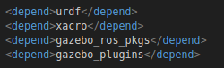
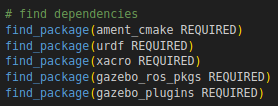
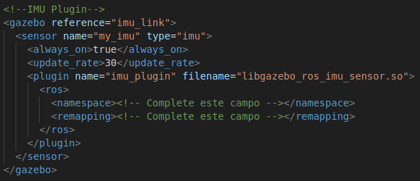
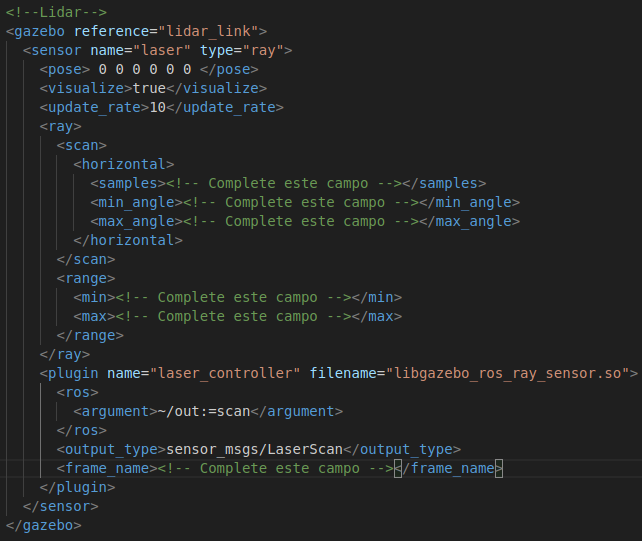
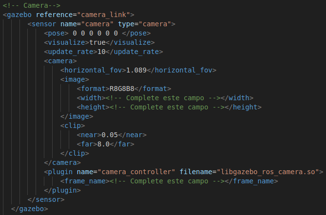
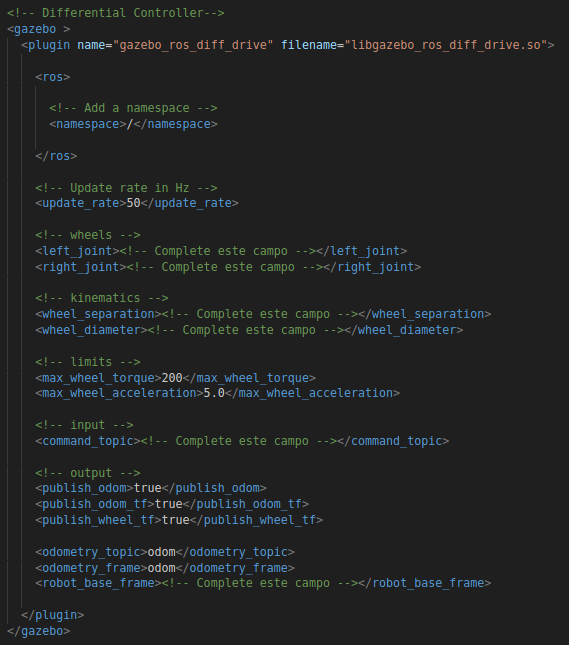

# Gazebo Plugins with ROS2

This exercise aims to present and practice the creation and use of Gazebo plugins in a mobile robotics context using ROS2. At the end of the steps, you will be able to:

- Create ```.xacro``` files to add sensors and controllers to the robot.

- Add and configure IMU, LIDAR, Camera and Joint Controller plugins.

- Explore and modify relevant parameters of each plugin to understand their effects on the simulation.

## 1. Installation of packages and configuration of the ```robot_description``` package

### 1.1 Installation of packages

To implement the plugins and controllers used in this lesson, the following packages will be needed:

- ```gazebo_ros_pkgs```
- ```gazebo_plugins```

To perform the installation, open a terminal and type the following commands:

```bash 
sudo apt update
sudo apt install ros-foxy-gazebo-ros-pkgs 
sudo apt install ros-foxy-gazebo-plugins 
```

### 1.2 Configuration of the ```robot_description``` package

- Inside the ```robot_description/urdf``` directory, create the file:
    
    - ```sensors.xacro```: Where the sensors plugins will be implemented.

- In the ```robot_description/package.xml``` file, add the dependencies:

    

- In the ```robot_description/CMakeLists.txt``` file, add also the dependencies:

    

Now our environment is configured to proceed with the exercises.

## 2. IMU Plugin

### 2.1 IMU Link

Similarly to creating links for the robot body and wheels, we will create a link to represent the position and orientation of the IMU:

- In the main file of the robot body, add a link for the IMU. 
- To maintain the standard pattern commonly used, name this link ```imu_link```.
- By normally being small and located inside the robot, it is not necessary to specify the inertia, collision and visual, only define the link.
- Create the joint between ```chassis``` and ```imu_link``` and name it ```imu_joint```. The joint should be of type fixed and can be located in the center of the robot body, aligned with the chassis.

### 2.2 IMU Plugin

Now that the IMU link is configured, we will add the plugin to it, which will be responsible for simulating its operation.

- Open the ```robot_description/sensors.xacro``` file
- Add the first tag of the robot, as well as in the main file
- Add the following code to the file:
    


### 2.3 Test

- Enter your workspace and compile the code using ```colcon build```.
- Load the environment variables with ```source install/setup.bash```.
- Run the ```launch``` file used in the previous classes, which should open rviz2 and Gazebo with the robot model and the created world.
- Through the command ```ros2 topic list```, check that the ```/imu/data``` topic is being published.
- Use the command ```ros2 topic echo``` to view the messages published by the plugin.
- In Gazebo, move and rotate your robot manually and check how this influences the signals sent by the IMU.

## 3. Lidar Plugin 

### 3.1 Lidar Link

- Following the same steps as the IMU, create a link for the LIDAR and name it ```lidar_link```.
- For this, define the visual and collision as a cylinder, similar to a hockey disc. This format is similar to various LIDARs on the market. Due to the difference in weight and size between the LIDAR and the robot, we will disregard its inertia, so it is not necessary to define it.
- Create the joint between ```chassis``` and ```lidar_link```, it should be fixed and the LIDAR should be located at the top of the robot, with a clear view of all its sides.

### 3.2 Lidar Plugin

- Add the following code to the ```sensors.xacro``` file:
    

- Complete the required fields:
    - ```samples```: Number of points that the LIDAR will have. Define it to be at least 1 point per degree that the LIDAR will operate.
    - ```min_angle``` e ```max_angle```: Minimum and maximum angles that the LIDAR will operate. As we want a 360º view, they should be defined, respectively, as -Pi and Pi.
    - ```min```: Minimum distance that the LIDAR will "see". At least 20cm.
    - ```max```: Maximum distance that the LIDAR will "see". Define a value that is capable of "seeing" your environment from any point.
    - ```frame_name```: Link of your LIDAR.

### 3.3 Test

- Repeat the procedure of the previous section and run the simulation.
- Check that the LIDAR topic is being published and view its messages.
- In ```rviz2```, add the LIDAR visualization.
- In Gazebo, move the robot manually and check how this reflects in the readings shown in ```rviz2```.
- Take a moment to modify the parameters defined in the previous step and see their influence on the simulation.

## 4. Camera Plugin

### 4.1 Camera Link

- Follow the steps of the last sections and create a link for the camera. Name it ```camera_link```.
- As with the LIDAR, only the definition of visual and collision is required.
- The visual can be a cube or a flattened cylinder.
- Create the joint between ```chassis``` and ```camera_link```, it should be positioned in front of the robot, with its orientation aligned with the ```chassis```.

### 4.2 Camera Plugin

- Add the following code to the ```sensors.xacro``` file:
    

- Complete os campos necessários:
    - ```width``` e ```height```: Resolution of your camera. A good value is 640x480. A very high resolution may require more processing.
    - ```frame_name```: Link of your camera.


### 4.3 Test

- Run the simulation.
- Check that the camera topics are being published.
- Check that the camera recording area is being represented in Gazebo.
- Add the image topic visualization to ```rviz2``` and see what is being recorded by the camera.
- Move the robot manually in Gazebo and see if the image seen in ```rviz2``` corresponds to the robot's location in Gazebo.
- Alter the value of ```<horizontal_fov>``` and see its effect on the simulation.

## 5. Differential Drive Plugin

Now, we will add the last plugin. It will be responsible for performing the inverse kinematics of the robot, converting a general command of linear and angular velocity of the robot, that is, that its center must perform, into velocities for each of its wheels.

### 5.1 Differential Drive plugin

- Add the following code to the ```sensors.xacro``` file:
    

- Complete the required fields:
    - ```left_joint``` e ```right_joint```: Fill in with the name of the joints corresponding to each of the wheels
    - ```wheel_separation```: Distance between wheels.
    - ```wheel_diameter```: Diameter of the wheels
    - ```command_topic```: Topic used to send the desired velocities. This topic is of type ```std_msgs/msg/Twist```. Usually, the name of the velocity command topic is ```/cmd_vel```.

### 5.2 Test
- Run the simulation.
- Check that the velocity topics are available.
- In a new terminal, run the node:
    ```bash
    ros2 run teleop_twist_keyboard teleop_twist_keyboard
    ```
    This node publishes directly to the ```/cmd_vel``` topic. If another control topic has been specified, it will be necessary to remap the node's output topic:
    ```bash
    ros2 run teleop_twist_keyboard teleop_twist_keyboard --ros-args --remap cmd_vel:=<Defined Topic>
    ```
- With this last terminal selected, use the indicated keys to send velocity commands to the robot.
- Check that it is walking in Gazebo.
- Alter the values of ```<wheel_diameter``` and ```<wheel_separation>``` and see their effect on the simulation.

## Conclusion

In this exercise, you added and tested IMU, Lidar, camera and differential drive (Differential Drive) plugins in Gazebo, integrated with ROS2. Through these steps, it was possible to:

- Understand how each sensor (IMU, Lidar, camera) is inserted and configured in the Xacro file.
- Configure and test each plugin, checking its publication topics and observing the result both in Gazebo and in Rviz2.
- Control the robot through linear and angular velocity commands (cmd_vel).


 

