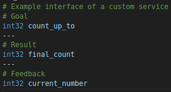
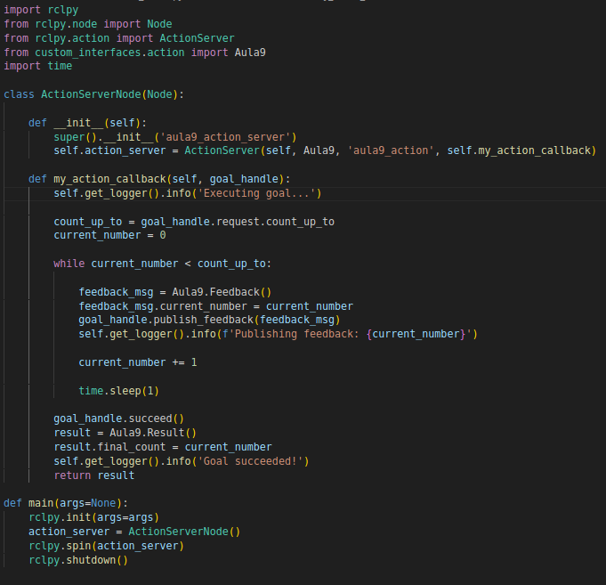
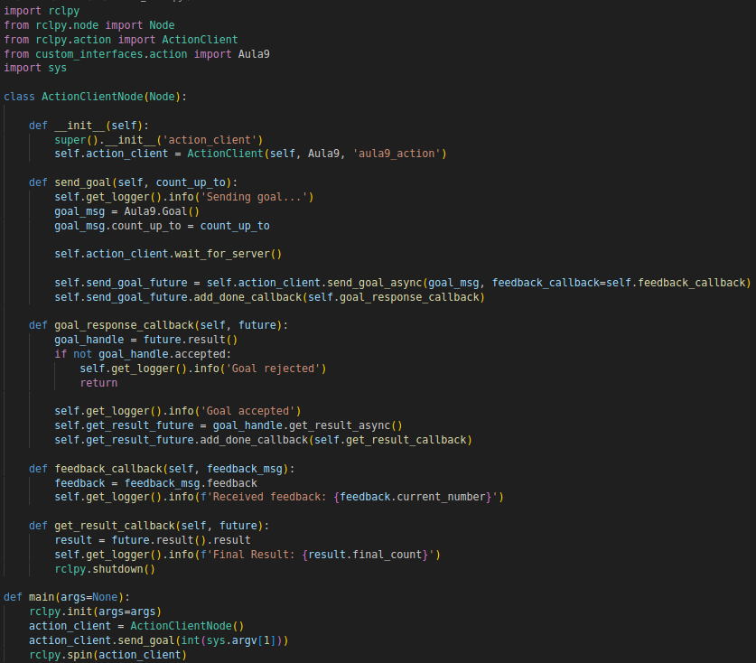

# Actions in ROS2

This guide will guide you through creating an action (server and client) in ROS2 using Python and a custom action interface. Follow each step carefully to understand how actions work in ROS2.

**Reading Suggestion**:

- [Understanding Actions](https://docs.ros.org/en/foxy/Tutorials/Beginner-CLI-Tools/Understanding-ROS2-Actions/Understanding-ROS2-Actions.html)

- [Writing an action server and client (Python)](https://docs.ros.org/en/foxy/Tutorials/Intermediate/Writing-an-Action-Server-Client/Py.html)

## 1. Create a workspace 

1. Choose a directory on your machine to create your workspace. In this example, we will use ~/aula9_ws, but you can use another one if you prefer.

2. In the terminal, create the directory and the src folder inside it:

    ```bash
    mkdir -p ~/aula9_ws/src
    cd ~/aula9_ws
    ```

- In ROS2, the concept of **workspace** is used to organize packages and compile code using ```colcon build```.

- The ```src``` folder is the default directory where ROS2 packages should be located within the **workspace**.

## 2. Copy the structure of the ```custom_interfaces``` package

In the ```.zip``` file of the lesson, you will find the ```custom interfaces``` package. This package will be responsible for defining and grouping the custom interfaces that you need for this exercise. It has the following structure:

```css
    custom_interfaces
    ├── package.xml
    ├── CMakeLists.txt
    └── action
        └── (folder for .action files)
```

In it, the ```CMakeLists.txt``` and ```package.xml``` files will already have the dependencies configured for the installation of custom interfaces for ROS2. In the ```action``` directory, the custom action interfaces will be placed, which have the ```.action``` extension.

1. Copy the provided ```custom_interfaces``` package into ```~/aula9_ws/src```. In the end, the structure of your workspace should look like this:

    ```css
    ros2_ws
    └── src
        ├── custom_interfaces
        │   ├── package.xml
        │   ├── CMakeLists.txt
        │   └── action
        │       └── ...
    ```

## 3. Create a custom service interface

1. Inside the ```action``` directory of the ```custom_interfaces``` package, create a file called ```Aula9.action```
- Normally, interface names are written with all the names together, with the first letter of each name in capital letters and ending with the extension of the interface type, for example: ```AçãoCustomizada.action```

2. Add the following content to the file:



An action interface is divided as follows:

- **Goal**: Composed of the first values ​​to be declared, one on each line. Each value is declared by its type, followed by the name.

- **Result**: Values ​​sent as a response after the action is completed.

- **Feedback**: Partial message sent during the execution of the action

- **Separator**: Responsible for separating, in the interface, which values ​​are part of the objective, feedback and result. Its format is three consecutive hyphens: ```---```

In this case, the action will receive an integer (```count_up_to```) as objective, will send an integer (```current_number```) as feedback, and, at the end, will return an integer (```final_count```) as result.

3. In the ``CMakeLists.txt``` file, declare the newly created interface to be installed:

    ```bash
    rosidl_generate_interfaces(${PROJECT_NAME}
        "action/Aula9.action"
    )
    ```

## 4. Compile the ```custom_interfaces``` package

Now let's compile the workspace so that ROS2 can generate the definitions for this new service interface.

1. In the terminal, inside ```~/aula9_ws```, run:

```bash
colcon build
```

2. Then, update the environment:

```bash
source install/setup.bash
```

3. Check if the interface is available. In the terminal, run:

```bash
ros2 interface list
```

And see if the newly created interface is among the available ones

Now, see if the interface matches the one that was created:

```bash
ros2 interface show custom_interfaces/action/Aula9
```

## 5. Create a new Python package

Let's create a new ROS2 **python** package, inside the ```~/aula9_ws/src``` directory, to create the nodes for this class.

1. In the terminal, type:

```bash
cd ~/aula9_ws/src
ros2 pkg create aula9 --build-type ament_python --dependencies rclpy custom_interfaces
```

This command will create a new package called ```aula9```. The ```--build-type ament_python``` argument will define the package structure as python. The ```--dependencies rclpy custom_interfaces``` argument will automatically add the indicated dependencies to the ```package.xml``` file.

2. The created package must contain the following structure:

    ```css
    aula9
    ├── package.xml
    ├── setup.py
    ├── resource
    │   └── aula9
    ├── setup.cfg
    └── aula9
        ├── __init__.py
    ````

The nodes will be created in the directory of the same name of the package, in this case ```aula9/aula9/```.

## 6. Create an action server node in ROS2

Let's create a Python script that will act as an action server. It will “listen” for the requested goals, execute the action, send feedback during it and, at the end, return the result.

1. Inside the ```aula9/aula9/``` directory, create a file called ```action_server.py``` with the following content:

    

### Code Explanation

The code defines an Action Server in ROS2 that receives a goal, counts to a specified number, and sends periodic feedback while counting. At the end, it returns the result of the count.

**1. Imports**

```python
import rclpy
from rclpy.node import Node
from rclpy.action import ActionServer
from custom_interfaces.action import Aula9
import time
```

- ```rclpy```: ROS2 core library for Python.

- ```rclpy.node.Node```: Base class for creating ROS2 nodes.

- ```rclpy.action.ActionServer```: Class that allows you to create an Action Server.

- ```custom_interfaces.action.Aula9```: Imports the custom action interface (Aula9.action), which contains the action definition (Goal, Feedback and Result).

- ```time```: Used to create a pause (time.sleep(1)) between each iteration of the count.

**2. Server Node Definition**

```python
class ActionServerNode(Node):
    def __init__(self):
        super().__init__('aula9_action_server')
        self.action_server = ActionServer(
            self, 
            Aula9, 
            'aula9_action', 
            self.my_action_callback
        )
```

- ```class ActionServerNode(Node)``` → Creates a class called ActionServerNode, which inherits from Node, making it a ROS2 node.

- ```super().__init__('aula9_action_server')``` → Initializes the node with the name 'aula9_action_server'.

- **Action Server Creation:**

- ```self.action_server = ActionServer(...)``` creates an Action Server with the following parameters:
- ```self```: The node where the server will be executed.
- ```Aula9```: The type of action, defined in the .action interface.
- ```'aula9_action'```: Name of the action service (this is the name that the client will call to send a goal). - ```self.my_action_callback```: Function called when a goal is received.

**3. Action Callback**

```python
def my_action_callback(self, goal_handle):
    self.get_logger().info('Executing goal...')

    count_up_to = goal_handle.request.count_up_to
    current_number = 0

    while current_number < count_up_to:

        feedback_msg = Aula9.Feedback()
        feedback_msg.current_number = current_number
        goal_handle.publish_feedback(feedback_msg)
        self.get_logger().info(f'Publishing feedback: {current_number}')

        current_number += 1

        time.sleep(1)

    goal_handle.succeed()
    result = Aula9.Result()
    result.final_count = current_number
    self.get_logger().info('Goal succeeded!')
    return result
```

- ```my_action_callback(self, goal_handle)```
- Function that executes the action when a client sends a goal.
- ```goal_handle``` is the object that contains the client's request.

- Reads the value of the Goal (**Goal**):

```bash
count_up_to = goal_handle.request.count_up_to
```
- The client will send a number as a goal (```count_up_to```), which is the value up to which the server should count.

- **Creating and sending feedback**:

```bash
feedback_msg = Aula9.Feedback()
feedback_msg.current_number = current_number
goal_handle.publish_feedback(feedback_msg)
```

- A feedback object is created and updated with ```current_number```. - Feedback is published so the client can track progress.

- **Ends the action successfully**:

```bash
gal_handle.succeed()
```

- Informs ROS2 that the goal was successfully achieved.

- **Fills and returns the result**:

```bash
result = Class9.Result()
result.final_count = current_number
self.get_logger().info('Goal succeeded!')
return result
```

- Creates a result object.
- Sets result.final_count to the final number counted.
- Returns ```result``` to the client

**4. Main function (```main```)**:

```python
def main(args=None):
rclpy.init(args=args)
action_server = ActionServerNode()
rclpy.spin(action_server)
rclpy.shutdown()
```

- ```rclpy.init(args=args)``` → Initializes ROS2.

- ```action_server = ActionServerNode()``` → Creates an instance of the ActionServerNode node, which starts the action server.

- ```rclpy.spin(action_server)``` → Keeps the node alive to process client requests.

- ```rclpy.shutdown()``` → Terminates ROS2 when the node is shut down.

### Summary

1. The server starts and waits for goals.

2. When a client sends a goal:
- The server starts counting from ```0``` to ```count_up_to```.
- For each number counted, it sends feedback to the client.
- It waits 1 second between each increment.

3. When the final number is reached:
- The server successfully completes the action (```goal_handle.succeed()```).
- It returns ```result.final_count``` with the final number counted.

4. The node continues running, ready to receive new goals.


## 7. Run the Action Server

1. Before running, edit the ```setup.py``` file inside ```aula9```, to register this script as executable. Add in entry_points:

    ```python
    entry_points={
        'console_scripts': [
            'action_server = aula9.action_server:main',
        ],
    },
    ```

   This step is necessary whenever a new node is created. The command is structured as follows:

- ```action_server```: Name that will be used to execute the script

- ```aula9```: Package name

- ```action_server```: Name of the Python script to be registered

- ```:main```: Function of the script that will be executed

2. In a terminal, go back to the workspace root directory ```~/aula9_ws```, compile again and update the environment:

```bash
colcon build
source install/setup.bash
```

3. Now, run the service

```bash
ros2 run aula9 action_server
````

## 8. Check if the action server is running through the terminal

1. In a new terminal, without interrupting the previous one, update the environment with ```source install/setup.bash```

2. List the available services

```bash
ros2 action list
```

You should see ```/aula9_action``` among the listed services

3. List the active nodes:

```bash
ros2 node list
```

You should see ```/aula9_action_server``` among the listed nodes

With These last steps make it possible to verify the existence of the action, with the correct interface, and that the node is running.

### 9. Call the service from the terminal

Without needing to create a client in Python, we can call the action directly from the terminal using the command ```ros2 action send_goal```.

1. In the same terminal where you are not running the server (or open a third terminal):

```bash
ros2 action send_goal /aula9_action custom_interfaces/action/Aula9 "{count_up_to: 5}"
```

2. In the terminal where you typed the command, the following will be displayed:

    ```bash 
    Waiting for an action server to become available...
    Sending goal:
        count_up_to: 5

    Goal accepted with ID: 88d788c4450245299e27ffbdb7d0b23e

    Result:
        final_count: 4

    Goal finished with status: SUCCEEDED
    ```

    ```ros2 service send_goal [action] [interface] [goal]``` is a command line tool for sending service requests without having to write client code. It is a simple way to verify that the server works.

## 10. Create an action client in ROS2

Now that we have verified that the action works, let's create a **client** in Python that sends the request to our server.

1. In the ```aula9/aula9``` folder, create a file ```action_client.py``` and copy the code below.



### Code explanation

The code defines an Action Client in ROS2 that sends a goal to the server, receives continuous feedback and prints the final result when the action ends.

**1. Importing the libraries**

```python
import rclpy
from rclpy.node import Node
from rclpy.action import ActionClient
from custom_interfaces.action import Aula9
import sys
```

- ```rclpy```: ROS2 core library for Python.

- ```rclpy.node.Node```: Base class for creating ROS2 nodes.

- ```rclpy.action.ActionClient```: Class that allows you to create an Action Client.

- ```custom_interfaces.action.Aula9```: Imports the action interface (```Aula9.action```), which contains the action definition (Goal, Feedback and Result).

- ```sys```: Allows you to capture arguments passed by the terminal (for example, the number to count to).

**2. Defining the Client Node**

```python
class ActionClientNode(Node):
    def __init__(self):
        super().__init__('action_client')
        self.action_client = ActionClient(self, Aula9, 'aula9_action')
```

- ```class ActionClientNode(Node)``` → Defines a node called ```ActionClientNode```, which inherits from ```Node```, making it a ROS2 node.

- ```super().__init__('action_client')``` → Initializes the node with the name 'action_client'.

- Creating the Action Client:

- ```self.action_client = ActionClient(...)``` creates a client to send goals to the server.

- ```Aula9```: Type of action, defined in the .action interface.

- ```'aula9_action'```: Name of the Action Server that will be called.

**3. Send a goal**

```python
def send_goal(self, count_up_to):
    self.get_logger().info('Sending goal...')
    goal_msg = Aula9.Goal()
    goal_msg.count_up_to = count_up_to

    self.action_client.wait_for_server()

    self.send_goal_future = self.action_client.send_goal_async(
        goal_msg, 
        feedback_callback=self.feedback_callback
    )
    self.send_goal_future.add_done_callback(self.goal_response_callback)
```

- **Create the goal message**:

    ```bash
    goal_msg = Aula9.Goal()
    goal_msg.count_up_to = count_up_to
    ```

- **Wait for the server to be available**:

```bash
self.action_client.wait_for_server()
```
- If the server is not running, wait until it becomes available.

- **Send the goal asynchronously**:

```bash
self.send_goal_future = self.action_client.send_goal_async(goal_msg, feedback_callback=self.feedback_callback)
```

- The goal is sent to the server asynchronously.

- If the goal is accepted, the server starts processing the count.

- Set ```feedback_callback``` to handle feedback during execution.

- **Wait for server response**:

```bash
self.send_goal_future.add_done_callback(self.goal_response_callback)
```

- When the server accepts or rejects the goal, call ```goal_response_callback```.

**4. Server Response**

```python 
def goal_response_callback(self, future):
    goal_handle = future.result()
    if not goal_handle.accepted:
        self.get_logger().info('Goal rejected')
        return

    self.get_logger().info('Goal accepted')
    self.get_result_future = goal_handle.get_result_async()
    self.get_result_future.add_done_callback(self.get_result_callback)
```

- **Receives the response from the server (```future.result()```) and stores it in ```goal_handle```**.

- **If the goal is rejected, print**:

    ```bash
    if not goal_handle.accepted:
        self.get_logger().info('Goal rejected')
        return
    ```

- **If the goal is accepted, print and wait for the final result**:
```bash
self.get_logger().info('Goal accepted')
self.get_result_future = goal_handle.get_result_async()
self.get_result_future.add_done_callback(self.get_result_callback)
```

- The client waits for the server to finish.

- When the server finishes, ```get_result_callback``` is called.

**5. Receiving Feedback**

```python
def feedback_callback(self, feedback_msg):
    feedback = feedback_msg.feedback
    self.get_logger().info(f'Received feedback: {feedback.current_number}')
```

- **Receives feedback from the server during execution**.

- **Extracts information about the current number counted (```current_number```)**.

- **Prints the feedback**.

**6. Processing the final result**

```python
def get_result_callback(self, future):
    result = future.result().result
    self.get_logger().info(f'Final Result: {result.final_count}')
    rclpy.shutdown()
```

- **Wait for the final result from the server (```future.result().result```)**.

- **Print the final counted number**:

```python
self.get_logger().info(f'Final Result: {result.final_count}')
```

- **Shut down the node**:

```pyhton
rclpy.shutdown()
```

- After the final result is received, the node shuts down.

**7. Main Function (```main```)**

```python
def main(args=None):
    rclpy.init(args=args)
    action_client = ActionClientNode()
    action_client.send_goal(int(sys.argv[1]))
    rclpy.spin(action_client)
```

- **Initialize ROS2**:

```python
rclpy.init(args=args)
```

- **Create the client**:

```python
action_client = ActionClientNode()
```

- **Send the goal as a value provided via terminal**:

```python
action_client.send_goal(int(sys.argv[1]))
```

- **Keep the client running to process feedback**:

    ```python 
    rclpy.spin(action_client)
    ````

### General summary

- The client communicates with the server, sending and receiving targets.

- Monitors the progress of the execution via feedback.

- Receives and displays the final result after the action is completed.

- Automatically terminates after execution.

## 11. Run the Action Client

1. Check if any terminal is running any node; if so, stop it.

2. Just like the server, add this node as executable in the ```setup.py``` file:

    ```python 
    entry_points={
        'console_scripts': [
            'action_server = aula9.action_server:main',
            'action_client = aula9.action_client:main',
        ],
    },
    ```
3. In a terminal, return to the workspace root directory ```~/aula9_ws```, compile again and update the environment:

    ```bash
    colcon build
    source install/setup.bash
    ```

4. Now, execute the client

    ```bash
    ros2 run aula9 action_client count_up_to
    ````

    Replacing the **count_up_to** arguments with the number you want to count up to.

    You should see something in the terminal like:

    ```bash
    [INFO] [1740333773.741903943] [action_client]: Sending goal...
    ```

## 12. Run the server in another terminal

1. Open another terminal and run the **server** again:

```bash
ros2 run aula8 srv_server
```

2. As soon as the server starts, the client (in the other terminal) should detect the action and send the target.

3. In the client terminal, something like this will appear:

    ```bash
    [INFO] [1740334386.396987461] [action_client]: Sending goal...
    [INFO] [1740334390.931664366] [action_client]: Goal accepted
    [INFO] [1740334390.945446241] [action_client]: Received feedback: 0
    [INFO] [1740334391.947944393] [action_client]: Received feedback: 1
    [INFO] [1740334392.950042569] [action_client]: Received feedback: 2
    [INFO] [1740334393.954835811] [action_client]: Received feedback: 3
    [INFO] [1740334394.957405174] [action_client]: Received feedback: 4
    [INFO] [1740334395.961401636] [action_client]: Final Result: 5
    ```

## Practice Exercise

### General Objective

**Create an action** (server and client) capable of moving the differential robot until it reaches a specific displacement distance (for example, X meters forward or backward), sending periodic feedback on progress and allowing cancellation.

### Suggested steps:

1. Create a custom action interface, containing at least the following information:

**Goal**:

- **distance (float64)**: Linear distance to be traveled.

- **speed (float64)**: Desired linear speed of the robot.

**Result**

- **success (bool)**: Boolean indicating the success of the task.

- **message (string)**: Indicates what happened to complete the action.

**Feedback**

- **current_distance (float64)**: Distance traveled.

2. Create an Action server that:

- Subscribes to the ```/odom``` topic to track the robot's initial position and how far it has moved.

- When receiving a goal, it records the robot's initial position (for example, ```x0```, ```y0```).

- Publishes to ```/cmd_vel``` to move the robot in the requested direction.

- During movement, it sends constant feedback with the current distance traveled.

- When reaching the desired distance (or close to it), it stops the robot and returns ```success=true```.

3. Create the Action Client that:

- Sends a goal with the desired distance and speed.

- Receives periodic feedback (prints the distance traveled on the terminal, for example).

- At the end, it shows whether it completed successfully or was canceled.

## Conclusion

In this lesson, you created and tested an action in ROS2 from scratch:

1. Defined a package of custom interfaces (custom_interfaces) and compiled it to generate the action interface (Lesson9.action).

2. Created a Python package (Lesson9) with the action server and action client code.

3. Executed and validated the communication: sending goals, receiving feedback and final result.

**Actions** are very useful in ROS2 when we need long-term tasks or continuous feedback (such as navigation, movement of robotic manipulators or prolonged calculations). This is the big difference in relation to Services, which handle quick and specific requests without progress monitoring.

