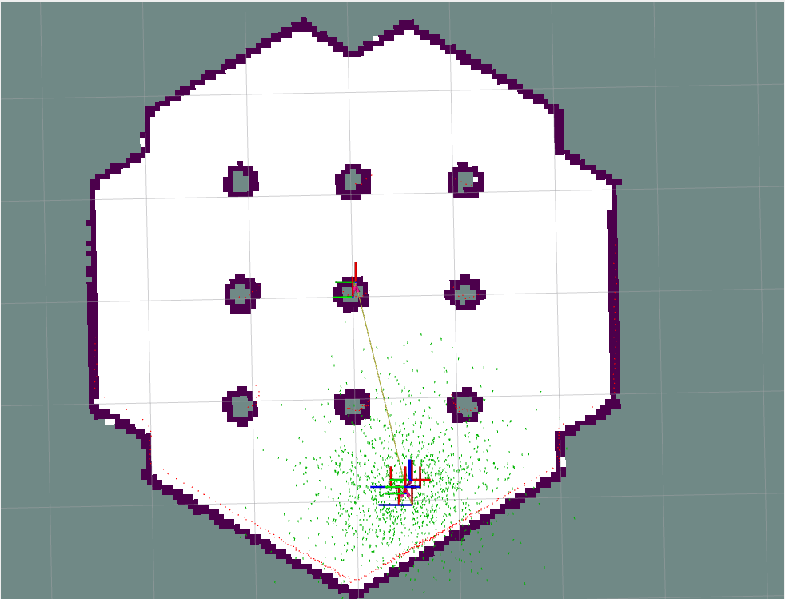
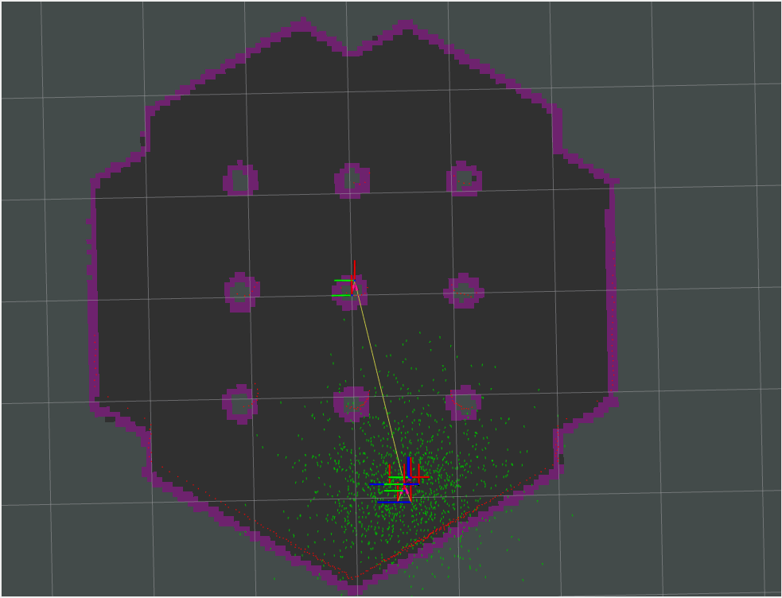
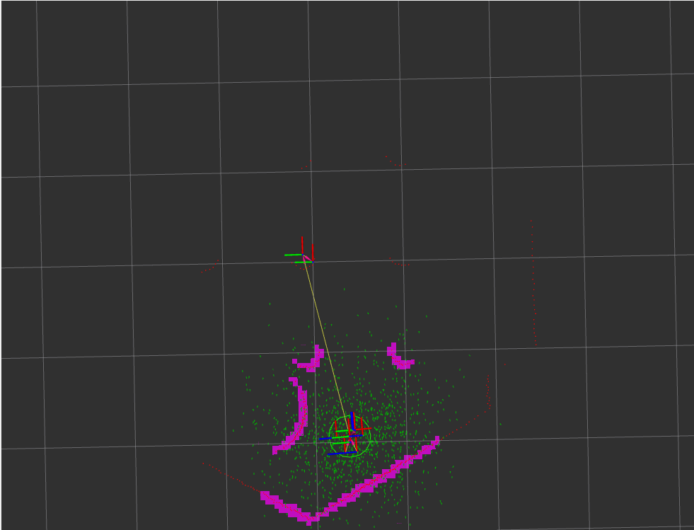
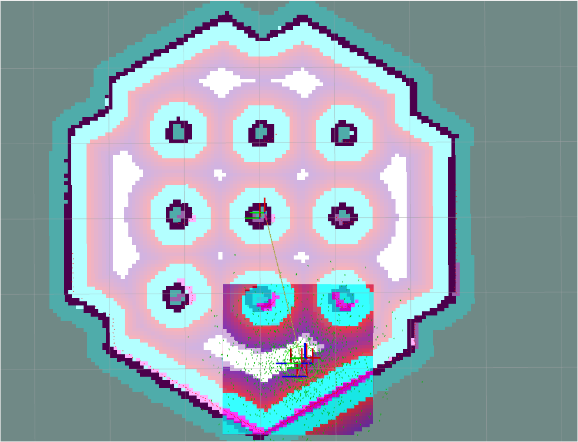

# Costmaps (Global and Local)

In this exercise, you will visualize and understand each layer used to construct the cost maps used by **Nav2** for autonomous navigation. In addition, you will change the main configuration parameters in the ```.yaml``` file and analyze their influence on navigation.

## 1. Cost map layers

In this part of the exercise, one cost map layer will be added at a time. To visualize how the final map is constructed and the contribution of each layer.

### 1.1 Static layer

This layer is created from the **occupancy map** published by **map_server**, usually in the ```/map``` topic. This layer basically fills pixels of the map based on the occupancy map, assigning the value of 255 (**occupied/lethal**) in spaces with obstacles and 0 in free spaces.

1. In the navigation parameters configuration file (```.yaml```), locate the sections referring to ```local_costmap``` and ```global_costmap```.

2. In each of the sections, locate the ```plugins``` parameter. This parameter defines which layers, in order, will be added to the final map. In ```global_costmap```, leave only the ```static_layer``` layer. In ```local_costmap```, leave only the ```voxel_layer``` layer, which we will see in more detail in the next sections.

3. Save the file, compile the workspace and run the simulation, as in the previous lessons.

4. Once the simulation loads, define the initial position of the robot so that it starts publishing the maps. Then, in the left sidebar of **rviz**, remove the view from the ```Controller``` folder

5. Now, we have only the **occupancy map** and the **local cost map** displayed, as in the image below:

    

    

    Toggle the **occupancy map** visualization on and off in **rviz**. You should see that the **global cost map** you created occupies the same cells.

6. Close the simulation

### 1.2 Obstacle/Voxel Layer

These layers are mainly responsible for adding dynamic obstacles, and are created/updated in real time from sensor readings. Both layers serve the same purpose, the difference between them is in the type of data they process. While the ```obstacle_layer``` uses **2D** data, the ```voxel_layer``` uses 3D data.

1. Start the simulation, and, once loaded, define the initial position of the robot.

2. In the **gazebo** screen, add an element (cube, cylinder, sphere) close to the robot.

3. In the **rviz** side panel, activate and deactivate the ```Controller``` and ```Global Planner``` visualization, which contain, respectively, the visualization of the local and global cost map.

    

    

    

    You should see that the obstacle placed near the robot is added to the **local cost map**, but not to the **global cost map**. Note that in the global one, you can see the lidar readings indicating the presence of an obstacle, but it is not added to the map.

4. In the configuration file, add the ```obstacle_layer``` to the ```global_costmap``` plugins. Repeat the previous steps and verify that, now, the obstacles identified by the lidar are added to the generated map.

### 1.3 Inflation Layer

This layer is generated from the previous layers. Its purpose is to "inflate" the obstacles, that is, to create a safe region around them. This region will contain cost values ​​between 1-253, which will decrease exponentially as the region moves away from the obstacle. This layer serves mainly to ensure that the planner maintains a safe distance from the robot, without having to consider the robot's geometry for this.

1. Start the simulation, and, once loaded, define the robot's initial position.

2. Send navigation commands and watch the robot navigate. Repeat the process until the planned path passes close to/close to an obstacle.

In this case, the robot should end up colliding with the obstacle. This happens because the global planner used does not consider the robot's geometry for planning, it only plans the path that should be followed by the robot's ```base_link``` frame.

3. Add ```inflation_layer``` to the plugins list of both ```global_costmap``` and ```local_costmap```. You should see something like the image below:

    

    See that now, around each obstacle, a layer extends.

4. Send navigation commands again. Note that now the planner tries to trace a path between the obstacles, staying in the region that presents the lowest **cost** and trying to avoid areas close to the obstacles, which have the highest **cost**.

## 2. Main Parameters

Now that we understand the purpose of each layer, let's look at some of the main configuration parameters used to tune the costmap

1. **resolution**: Defines how many meters in reality correspond to a pixel on the generated map. The value is defined in meters.

2. **rolling_window**: Defines whether the map will "roll" along with the robot. This way, the robot always stays in the center of the map. Useful in situations where the map is very large.

3. **width, height**: Determines the size of the map

4. **inflation_radius (inflation layer)**: Maximum distance that the "inflated" layer will extend from the obstacle

5. **cost_scaling_factor (inflation layer)**: Exponential decay rate of the cost through the inflated layer.

Change the parameters presented above and see how they influence the construction of the maps and the planning/navigation. For more details on other available configuration parameters, please visit [this link](https://docs.nav2.org/configuration/packages/configuring-costmaps.html)
