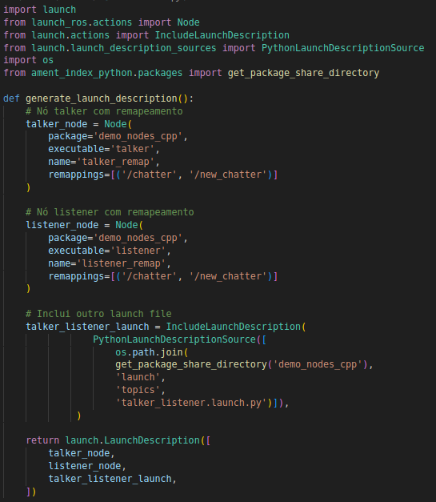
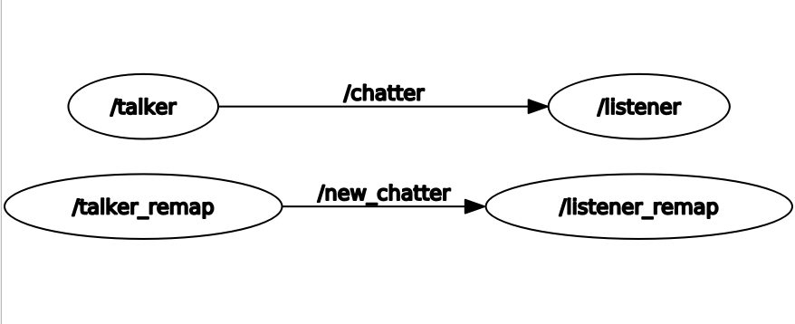

# Launch Files in ROS2

This script will guide you through creating a release file in ROS2, inside a Python package, with step-by-step explanation.

A launch file in ROS 2 is a file used to automate the execution of multiple nodes and configure your environment in an organized way. Instead of manually starting each node with separate commands in the terminal, the launch file allows you to start all the necessary nodes of an application with a single command.

## 1. Create a workspace

1. Choose a directory on your machine to create your workspace.
In this example, we will use ~/aula10_ws, but you can use another one if you prefer.

2. In the terminal, run the following commands to create the workspace and src/ folder:

    ```bash
    mkdir -p ~/aula10_ws/src
    cd ~/aula10_ws
    ```

- In ROS2, the concept of **workspace** is used to organize packages and compile code using ```colcon build```.

- The ```src``` folder is the default directory where ROS2 packages should be located within the **workspace**.

## 2. Create a Python package called aula10

Now, we will create a package called ```aula10```, which will store our launch file.

1. In the terminal, type:

    ```bash
    cd ~/aula10_ws/src
    ros2 pkg create aula10 --build-type ament_python --dependencies rclpy
    ```

2. The package will have the following initial structure:

    ```bash
    aula10/
    ├── package.xml
    ├── setup.py
    ├── resource/
    │   └── aula10
    ├── setup.cfg
    └── aula10/
        ├── __init__.py
    ```

## 3. Create the ```launch``` directory

1. Inside the ```aula10``` directory, create the ```launch``` folder to store launch files:

    ```bash
    mkdir ~/aula10_ws/src/aula10/launch
    ```

2. Now, your directory structure should look like this:

    ```bash
    aula10/
    ├── launch
    ├── package.xml
    ├── setup.py
    ├── resource/
    ├── setup.cfg
    └── aula10/
        ├── __init__.py
    ```

## 4. Create the ```aula10.launch.py``` file

Now let's create the launch file that initializes the ```talker``` and ```listener``` nodes, remapping the ```/chatter``` topic to ```/new_chatter```.

1. Create the ```aula10.launch.py``` file inside the ```launch``` folder:

    ```bash
    touch ~/aula10_ws/src/aula10/launch/aula10.launch.py
    ```

2. Open the file and add the following code:

    

### Explanation of the code

1. Imports

    ```python
    import launch
    from launch_ros.actions import Node
    from launch.actions import IncludeLaunchDescription
    from launch.launch_description_sources import PythonLaunchDescriptionSource
    import os
    from ament_index_python.packages import get_package_share_directory
    ```

- ```import launch``` → Imports the base launch system in ROS 2.

- ```from launch_ros.actions import Node``` → Allows you to create and configure ROS 2 nodes inside the launch file.

- ```from launch.actions import IncludeLaunchDescription``` → Allows you to include another launch file inside this one, making the code modular.

- ```from launch.launch_description_sources import PythonLaunchDescriptionSource``` → Specifies that the included launch file is in Python.

- ```import os``` → Used to manipulate file/directory paths.

- ```from ament_index_python.packages import get_package_share_directory``` → Automatically locates the share directory of an installed ROS 2 package.

2. Main function: ```generate_launch_description()```

    ```python
    def generate_launch_description():
    ```

    Esta função retorna uma ```LaunchDescription```, que contém todos os elementos que devem ser executados ao rodar o launch file.

3. Creating the ```talker``` node with remapping

    ```python
    talker_node = Node(
        package='demo_nodes_cpp',
        executable='talker',
        name='talker_remap',
        remappings=[('/chatter', '/new_chatter')]
    )
    ```

- ```package='demo_nodes_cpp'``` → Defines which package the node is in, in this case ```demo_nodes_cpp``` (a standard example package in ROS 2).

- ```executable='talker'``` → Defines the node that will be executed.

- ```name='talker_remap'``` → Name of the node in ROS 2.

- ```remappings=[('/chatter', '/new_chatter')]``` → Remaps the topic name.

4. Creating the ```listener``` node with remapping

    ```python
        listener_node = Node(
        package='demo_nodes_cpp',
        executable='listener',
        name='listener_remap',
        remappings=[('/chatter', '/new_chatter')]
    )
    ```

    Similar to the previous node

5. Including another launch file

    ```python
    talker_listener_launch = IncludeLaunchDescription(
        PythonLaunchDescriptionSource([
            os.path.join(
                get_package_share_directory('demo_nodes_cpp'), 
                'launch',
                'topics', 
                'talker_listener.launch.py'
            )
        ])
    )
    ```

- ```IncludeLaunchDescription()``` → Includes another launch file inside this one.

- ```PythonLaunchDescriptionSource()``` → Specifies that the included launch file is a Python script (```.py```).

- ```get_package_share_directory('demo_nodes_cpp')``` → Gets the path to the share directory of the demo_nodes_cpp package.

- ```os.path.join(...)``` → Constructs the path to find the launch file ```talker_listener.launch.py``` inside the ```demo_nodes_cpp``` package.

6. Returning the ```LaunchDescription```

    ```python 
    return launch.LaunchDescription([
        talker_node,
        listener_node,
        talker_listener_launch,
    ])
    ```

    This callback defines which elements will be thrown.

## 5. Add the **launch** directory to **setup.py**

1. In order for ROS2 to recognize the launch files in the package installation, edit the ```setup.py``` file and add the following line in the ```data_files``` field:

    ```python
    (os.path.join('share', package_name, 'launch'), glob('launch/*.py'))
    ```

2. At the top of the setup.py file, make sure to import the necessary libraries:

    ```python
    import os
    from glob import glob
    ```

- ```os.path.join()``` → Ensures that the path to the ```launch``` directory is correctly formatted on any operating system.

- ```glob('launch/*.py')``` → Automatically searches for all ```.py``` files within the ```launch``` directory, ensuring that they are installed in the correct location.

## 6. Compile the package and run the file

1. In the terminal, go back to the workspace directory and compile:

    ```bash
    cd ~/aula10_ws
    colcon build --packages-select aula10
    ```

2. After compilation, update the environment:

    ```bash
    source install/setup.bash
    ```

3. Now let's run the launch file and check if the nodes are running correctly:

    ```bash
    ros2 launch aula10 aula10.launch.py
    ```

## 7. Verify Communication Using
```rqt_graph```

1. In a second terminal, open the ```rqt_graph```:

    ```bash
    rqt_graph
    ```

    You should see something like:

    

    Note that we have the nodes whose names we changed communicating through the remapped topic, and separately, the nodes with the original names, launched by the launch file.


## Exercises

To reinforce the concepts learned in this lesson, let's do one more exercise.

Create a **launch file** to launch the following nodes:

- **Publisher** and **Subscriber** created in previous lessons.

- **Action Server** developed in the lesson on actions.

- **Service Server** developed in the lesson on services.

- **Launch file of Project 1**
