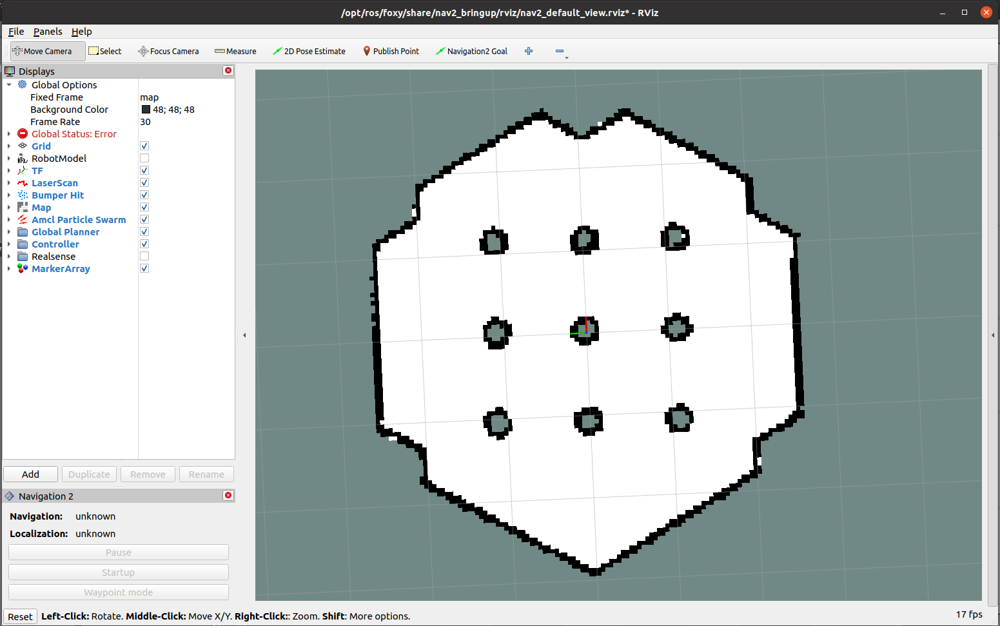
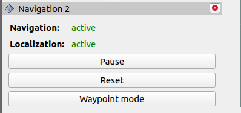

# Introduction to the ROS2 navigation package (Nav2)

In this lesson, we will start a sample simulation using the **Turtlebot3** robot, already configured with all the elements of the **Nav2** navigation package. The goal will be to start familiarizing yourself with the interface used and its modules.


## 1. Installing Packages

1. Install the **navigation2** package, it will contain all the libraries needed to perform autonomous navigation, including route planners and controllers.

    ```bash
    sudo apt install ros-foxy-navigation2 
    sudo apt install ros-foxy-nav2-bringup
    ```

2. Now, install the packages related to turtlebot3, this will be the example robot that we will use to illustrate how **nav2** works.

    ```bash
    sudo apt install ros-foxy-turtlebot3* 
    ```

3. Finally, a different version of **DDS** used by ROS will be installed. By default, ROS2 uses a distribution called **FastDDS**, however, it does not have good compatibility with the packages used by Nav2. Therefore, we will replace it with another distribution called **CycloneDDS**.

    ```bash
    sudo apt install ros-foxy-rmw-cyclonedds-cpp
    ```

## 2. Environment setup

At the end of your ```~/.bashrc``` file, add the following lines:

1. Configure variables for the **turtlebot3** package:

    ```bash
    export TURTLEBOT3_MODEL=burger
    export GAZEBO_MODEL_PATH=$GAZEBO_MODEL_PATH:/opt/ros/foxy/share/turtlebot3_gazebo/models
    ```

    These variables will define which robot model will be used for simulation and specify the path for gazebo to find the models related to the robot.

2. Configure **DDS** as **CycloneDDS**:

    ```bash
    export RMW_IMPLEMENTATION=rmw_cyclonedds_cpp
    ```

3. After performing the above steps and saving the ```~/.bashrc``` file, update the environment:

    ```bash
    source ~/.bashrc
    ```

## 3. Launching the simulation

The **nav2_bringup** package contains an example **launch file** that launches a complete simulation using turtlebot3 and all the packages required for autonomous navigation.

In a terminal, run the following command:

```bash
ros2 launch nav2_bringup tb3_simulation_launch.py
``` 

This command should open the gazebo environment, along with rviz already configured with all the elements used by **Nav2**.




Once the simulation environment is fully initialized, follow the steps below:

1. **Define the robot's initial position**

    By default, the **AMCL** localization package requires an estimate of the robot's initial position. In the ```rviz``` top toolbar, click on ```2D Pose Estimate``` and indicate on the map the robot's position and orientation, based on its location in the ```gazebo```.

    Once defined, the algorithm will start publishing the transform between the robot's position and the map, making it possible to view the sensor and algorithm data.

    

2. **Check Nav2 status**

    In the left sidebar, you should see a panel for **Nav2**

    

    Check if the ```Navigation``` and ```Localization``` fields are set to ```Active```.

    This indicates that both the servers required for navigation and the localization algorithm (**AMCL**) have been initialized correctly.

3. **Send a navigation command**

    Again, in the top toolbar of ```rviz```, click on ```Navigation2 Goal``` and select a point on the map. The robot should plan a route to the selected point and start navigating.

    

## 4. Sending multiple waypoints

**Nav2**, in addition to single points, allows you to send multiple waypoints as navigation goals, to be carried out sequentially.

1. **Activate the ```Waypoint mode```**

In the ```Navigation 2``` side panel, click on ```Waypoint mode```.

2. **Add Waypoints**

Using the ```Navigation2 Goal``` tool again, add at least three points on the map to be reached.

Note that for each point added, you must select the ```Navigation2 Goal`` tool again.

3. **Start navigation**

Again, in the ```Navigation 2``` side panel, click on ```Start Navigation```.

You will see the robot plan the route and navigate to the first point. Once the objective is reached, it must plan the route and navigate to the second point, and so on to complete the specified points.

## 5. Indicate a configuration file

The launch file that we are using to initialize **Nav2** is defined within the ```nav2_bringup``` package. In order to be able to change parameters during the next classes, we will bring this file to our workspace and indicate it when initializing the simulation. This will also make it easier, in the future, to configure and implement **Nav2** on your robot.

1. In the ```src``` directory of your **workspace**, create the ```rm_navigation``` package:

    ```bash
    ros2 pkg create rm_navigation --build-type ament_python --dependencies rclpy 
    ```

2. Inside the created package, add the ```config``` and ```launch``` folders. Remember to add them to the directories to be compiled when running ```colcon build```.

3. In the ```config``` directory, create the ``nav2_params.yaml``` configuration file and copy the parameters below:

    ```yaml
    amcl:
    ros__parameters:
        use_sim_time: True
        alpha1: 0.2
        alpha2: 0.2
        alpha3: 0.2
        alpha4: 0.2
        alpha5: 0.2
        base_frame_id: "base_footprint"
        beam_skip_distance: 0.5
        beam_skip_error_threshold: 0.9
        beam_skip_threshold: 0.3
        do_beamskip: false
        global_frame_id: "map"
        lambda_short: 0.1
        laser_likelihood_max_dist: 2.0
        laser_max_range: 100.0
        laser_min_range: -1.0
        laser_model_type: "likelihood_field"
        max_beams: 60
        max_particles: 2000
        min_particles: 500
        odom_frame_id: "odom"
        pf_err: 0.05
        pf_z: 0.99
        recovery_alpha_fast: 0.0
        recovery_alpha_slow: 0.0
        resample_interval: 1
        robot_model_type: "differential"
        save_pose_rate: 0.5
        sigma_hit: 0.2
        tf_broadcast: true
        transform_tolerance: 1.0
        update_min_a: 0.2
        update_min_d: 0.25
        z_hit: 0.5
        z_max: 0.05
        z_rand: 0.5
        z_short: 0.05
        scan_topic: scan

    amcl_map_client:
    ros__parameters:
        use_sim_time: True

    amcl_rclcpp_node:
    ros__parameters:
        use_sim_time: True

    bt_navigator:
    ros__parameters:
        use_sim_time: True
        global_frame: map
        robot_base_frame: base_link
        odom_topic: /odom
        enable_groot_monitoring: True
        groot_zmq_publisher_port: 1666
        groot_zmq_server_port: 1667
        default_bt_xml_filename: "navigate_w_replanning_and_recovery.xml"
        plugin_lib_names:
        - nav2_compute_path_to_pose_action_bt_node
        - nav2_follow_path_action_bt_node
        - nav2_back_up_action_bt_node
        - nav2_spin_action_bt_node
        - nav2_wait_action_bt_node
        - nav2_clear_costmap_service_bt_node
        - nav2_is_stuck_condition_bt_node
        - nav2_goal_reached_condition_bt_node
        - nav2_goal_updated_condition_bt_node
        - nav2_initial_pose_received_condition_bt_node
        - nav2_reinitialize_global_localization_service_bt_node
        - nav2_rate_controller_bt_node
        - nav2_distance_controller_bt_node
        - nav2_speed_controller_bt_node
        - nav2_truncate_path_action_bt_node
        - nav2_goal_updater_node_bt_node
        - nav2_recovery_node_bt_node
        - nav2_pipeline_sequence_bt_node
        - nav2_round_robin_node_bt_node
        - nav2_transform_available_condition_bt_node
        - nav2_time_expired_condition_bt_node
        - nav2_distance_traveled_condition_bt_node

    bt_navigator_rclcpp_node:
    ros__parameters:
        use_sim_time: True

    controller_server:
    ros__parameters:
        use_sim_time: True
        controller_frequency: 20.0
        min_x_velocity_threshold: 0.001
        min_y_velocity_threshold: 0.5
        min_theta_velocity_threshold: 0.001
        progress_checker_plugin: "progress_checker"
        goal_checker_plugin: "goal_checker"
        controller_plugins: ["FollowPath"]

        # Progress checker parameters
        progress_checker:
        plugin: "nav2_controller::SimpleProgressChecker"
        required_movement_radius: 0.5
        movement_time_allowance: 10.0
        # Goal checker parameters
        goal_checker:
        plugin: "nav2_controller::SimpleGoalChecker"
        xy_goal_tolerance: 0.25
        yaw_goal_tolerance: 0.25
        stateful: True
        # DWB parameters
        FollowPath:
        plugin: "dwb_core::DWBLocalPlanner"
        debug_trajectory_details: True
        min_vel_x: 0.0
        min_vel_y: 0.0
        max_vel_x: 0.26
        max_vel_y: 0.0
        max_vel_theta: 1.0
        min_speed_xy: 0.0
        max_speed_xy: 0.26
        min_speed_theta: 0.0
        # Add high threshold velocity for turtlebot 3 issue.
        # https://github.com/ROBOTIS-GIT/turtlebot3_simulations/issues/75
        acc_lim_x: 2.5
        acc_lim_y: 0.0
        acc_lim_theta: 3.2
        decel_lim_x: -2.5
        decel_lim_y: 0.0
        decel_lim_theta: -3.2
        vx_samples: 20
        vy_samples: 5
        vtheta_samples: 20
        sim_time: 1.7
        linear_granularity: 0.05
        angular_granularity: 0.025
        transform_tolerance: 0.2
        xy_goal_tolerance: 0.25
        trans_stopped_velocity: 0.25
        short_circuit_trajectory_evaluation: True
        stateful: True
        critics: ["RotateToGoal", "Oscillation", "BaseObstacle", "GoalAlign", "PathAlign", "PathDist", "GoalDist"]
        BaseObstacle.scale: 0.02
        PathAlign.scale: 32.0
        PathAlign.forward_point_distance: 0.1
        GoalAlign.scale: 24.0
        GoalAlign.forward_point_distance: 0.1
        PathDist.scale: 32.0
        GoalDist.scale: 24.0
        RotateToGoal.scale: 32.0
        RotateToGoal.slowing_factor: 5.0
        RotateToGoal.lookahead_time: -1.0

    controller_server_rclcpp_node:
    ros__parameters:
        use_sim_time: True

    local_costmap:
    local_costmap:
        ros__parameters:
        update_frequency: 5.0
        publish_frequency: 2.0
        global_frame: odom
        robot_base_frame: base_link
        use_sim_time: True
        rolling_window: true
        width: 1
        height: 1
        resolution: 0.05
        robot_radius: 0.22
        plugins: ["voxel_layer", "inflation_layer"]
        inflation_layer:
            plugin: "nav2_costmap_2d::InflationLayer"
            cost_scaling_factor: 3.0
            inflation_radius: 0.55
        voxel_layer:
            plugin: "nav2_costmap_2d::VoxelLayer"
            enabled: True
            publish_voxel_map: True
            origin_z: 0.0
            z_resolution: 0.05
            z_voxels: 16
            max_obstacle_height: 2.0
            mark_threshold: 0
            observation_sources: scan
            scan:
            topic: /scan
            max_obstacle_height: 2.0
            clearing: True
            marking: True
            data_type: "LaserScan"
        static_layer:
            map_subscribe_transient_local: True
        always_send_full_costmap: True
    local_costmap_client:
        ros__parameters:
        use_sim_time: True
    local_costmap_rclcpp_node:
        ros__parameters:
        use_sim_time: True

    global_costmap:
    global_costmap:
        ros__parameters:
        update_frequency: 1.0
        publish_frequency: 1.0
        global_frame: map
        robot_base_frame: base_link
        use_sim_time: True
        robot_radius: 0.22
        resolution: 0.05
        track_unknown_space: true
        plugins: ["static_layer", "obstacle_layer", "inflation_layer"]
        obstacle_layer:
            plugin: "nav2_costmap_2d::ObstacleLayer"
            enabled: True
            observation_sources: scan
            scan:
            topic: /scan
            max_obstacle_height: 2.0
            clearing: True
            marking: True
            data_type: "LaserScan"
        static_layer:
            plugin: "nav2_costmap_2d::StaticLayer"
            map_subscribe_transient_local: True
        inflation_layer:
            plugin: "nav2_costmap_2d::InflationLayer"
            cost_scaling_factor: 3.0
            inflation_radius: 0.55
        always_send_full_costmap: True
    global_costmap_client:
        ros__parameters:
        use_sim_time: True
    global_costmap_rclcpp_node:
        ros__parameters:
        use_sim_time: True

    map_server:
    ros__parameters:
        use_sim_time: True
        yaml_filename: "turtlebot3_world.yaml"

    map_saver:
    ros__parameters:
        use_sim_time: True
        save_map_timeout: 5000
        free_thresh_default: 0.25
        occupied_thresh_default: 0.65
        map_subscribe_transient_local: False

    planner_server:
    ros__parameters:
        expected_planner_frequency: 20.0
        use_sim_time: True
        planner_plugins: ["GridBased"]
        GridBased:
        plugin: "nav2_navfn_planner/NavfnPlanner"
        tolerance: 0.5
        use_astar: false
        allow_unknown: true

    planner_server_rclcpp_node:
    ros__parameters:
        use_sim_time: True

    recoveries_server:
    ros__parameters:
        costmap_topic: local_costmap/costmap_raw
        footprint_topic: local_costmap/published_footprint
        cycle_frequency: 10.0
        recovery_plugins: ["spin", "back_up", "wait"]
        spin:
        plugin: "nav2_recoveries/Spin"
        back_up:
        plugin: "nav2_recoveries/BackUp"
        wait:
        plugin: "nav2_recoveries/Wait"
        global_frame: odom
        robot_base_frame: base_link
        transform_timeout: 0.1
        use_sim_time: true
        simulate_ahead_time: 2.0
        max_rotational_vel: 1.0
        min_rotational_vel: 0.4
        rotational_acc_lim: 3.2

    robot_state_publisher:
    ros__parameters:
        use_sim_time: True
    ``` 

    Note that there is a section for each of the **Nav2** servers presented in class, with their respective configuration parameters.

4. Start the simulation again, now passing the file located in your workspace as a parameter:

    ```bash
    ros2 launch nav2_bringup tb3_simulation_launch.py params_file:=/path/to/your/config/file.yaml
    ```

5. Verify that the simulation and **Nav2** initialize correctly.

## 5. Explore Nav2

Take some time to explore autonomous navigation and **Nav2**. Send navigation targets at different points, distances, and orders to see how the robot behaves.

Additionally, in the ```rviz``` sidebar, you can see several visualization layers that have been added. These layers are related to some of the servers that make up **Nav2**, presented in class. Turn their visualization on and off as you navigate, trying to identify which server each of them is related to.
