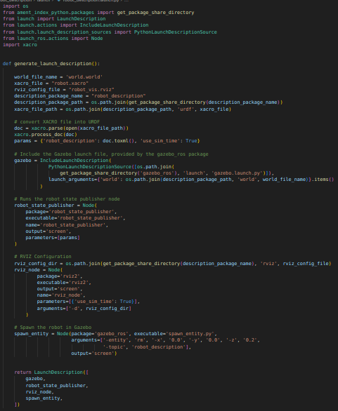

# Project 1 - Differential Robot Project in Gazebo

## 1. Introduction

In this Project, you will consolidate the knowledge acquired about creating worlds in Gazebo, modeling a differential robot using Xacro/URDF, and integrating Gazebo plugins. Your objective will be to create a complete simulation environment containing:

- A **world** in Gazebo.

- A **differential robot** with sensors and controller.

- A **launch** file to run the simulation and publish the robot's states.

This activity will allow you to practice the organization of the ROS2 workspace, the structure of packages and subdirectories, as well as the good practices of modeling in URDF/Xacro.

---

## 2. Project Structure

### 2.1 ROS2 Workspace (Standard Format)

Create a ROS 2 workspace following the typical convention, for example:

```bash
[seu nome]_ws/
├── src/
    └── robot_description/
```

The ```src``` directory will contain all the packages that will be created. For now, only the ```robot_description``` package.

### 2.2 ```robot_description``` Package

This package will contain the files related to the gazebo world to be created and the robot model. Its structure must be:

```bash
    robot_description/
    ├── package.xml
    ├── CMakeLists.txt
    ├── launch/
    ├── urdf/
    ├── rviz/
    └── world/
```

where:

- ```package.xml``` with the necessary dependencies (e.g.: ```gazebo_ros```, ```xacro```, ```robot_state_publisher```, etc.).

- ```CMakeLists.txt``` configured to compile the package correctly.

- ```launch/```: With a launch file (ex.: ```robot_simulation.launch.py```) responsible for:

    1. Start Gazebo with the created world;

    2. Execute the ```robot_state_publisher``` to publish the robot's joint states;
    
    3. Spawn the robot in Gazebo.

- ```world/```: With a .world file that describes the environment in Gazebo, along with the model of your house.

- ```urdf/```: With the description of the robot in .```xacro``` files.

- ```rviz```: With a Rviz2 configuration file

---

## 3. Gazebo World

The world to be created must be composed of at least:

- A one-story house with at least 4 rooms

- At least one access door for each of the rooms

- At least one window in each room

- At least one type of texture and color for the walls

- Different elements in each room.

The house model and the gazebo world must be saved in the ```robot_description/world``` directory.

---

## 4. Robot Model

### 4.1 File Structure

A differential robot model must be modeled with an appropriate size to be able to navigate in the created environment. The file structure must be, at least:

- ```robot_base.xacro```

- ```wheels.xacro```

- ```sensors.xacro```

### 4.2 ```robot_base.xacro```

This file must contain the following **frames**:

- ```base_link```: Centered and aligned with the robot's wheel axis

- ```chassis```: Robot body. Should be in the form of a cylinder or box and fixed joint, where the parent link should be ```base_link```.

- ```caster_ball```: Should be a sphere located at the bottom of the robot, with the purpose of balancing it. Its joint should be fixed with the parent link being ```chassis```. If you want, this element can be defined in a separate file.

- ```imu_link```: Should be aligned with the ```base_link``` of the robot. Its joint should be fixed and its parent link should be the frame ```chassis```. Inertia, collision and visual are not required to be specified, only define the link.

- ```lidar_link```: Should be located at the top of the robot, with clear view on all sides. Its joint should be fixed and its parent link should be the frame ```chassis```. For this link, define the visual and collision as a cylinder, similar to a hockey puck. Inertia is not required to be defined.

- ```camera_link```: Should be located in front of the robot, with its orientation aligned with the ```chassis```. Its joint should be fixed and its parent link should be the frame ```chassis```. The visual can be a cube or flattened cylinder. As with the lidar, only the definition of visual and collision is required.


In addition to these elements, the remaining files must be imported into this file and the wheels defined.

### 4.3 ```wheels.xacro```

This file must contain the link of the wheels, with the following requirements:

- A macro with the wheel link, which can be used to create more than one element.

- The properties of the wheel, such as ***length*** and ***radius***, should be defined at the beginning of the file, as reusable variables

- The joints can be defined within the macro or in the main file, and must have the frame ```base_link``` as its parent link. They should be positioned such that the wheels rotate around the **z** axis, following the **right-hand rule**.

### 4.4 ```sensors.xacro```

This file will contain the Gazebo plugins, being them:

- IMU Plugin: Publishing its data on the ```/imu/data``` topic.

- LIDAR Plugin: Publishing data on the ```/scan``` topic

- Camera Plugin: Publishing image data and camera information on the ```/camera/camera_info``` and ```/camera/image_raw``` topics, respectively.


- Differential Control Plugin: Correctly configured for the structure of your robot. It should receive command velocity from the ```/cmd_vel``` topic and publish odometry data on the ```/odom``` topic.

---

## 5. Launch File

In the ```robot_description/launch/``` directory, there should be a launch file ```robot_simulation.py```. This file should do the following:

- Open Gazebo with the created world

- Open the robot model in Gazebo, in a place where there are no obstacles.

- Run the ```robot_state_publisher``` node, which will publish the robot's joints and its model.

- Open Rviz with a pre-configured file to show:
    
    - The robot's joints
    - The robot's model
    - LIDAR data
    - Camera image

    This configuration file should be saved in the ```/robot_description/rviz/``` directory. 

As a base, the code below of a launch file can be used:



Remember to update the names of the files to be opened.

---

## 6. Delivery

The delivery of this Project must be done until 23:59 on February 28 (Friday). 

It must be delivered, through BlackBoard, a .zip file of your ROS workspace, as specified in **section 2** of this document. The directories, subdirectories and files must be configured so that the professor is able to compile the code in your workspace and run the launch file, opening all the files and nodes specified in **section 5** of this document.

## 7. Evaluation

The grade assigned to this activity will be an arithmetic average of each of the requirements specified in this document.
