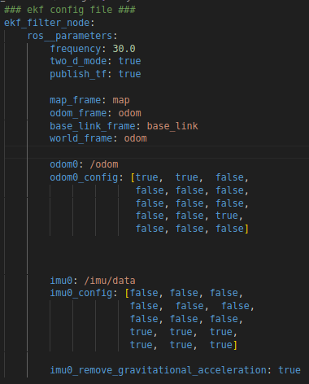

# Sensor Fusion

The **robot_localization** package is a set of nodes and utilities to perform data fusion from different sensors on a mobile robot, using Kalman Filter-based algorithms (e.g. EKF and UKF). It is widely used in ROS to combine measurements from sensors such as odometry, IMU, GPS, among others, in order to obtain a consistent estimate of the robot's pose (position and orientation).

## 1. Creating the Package

1. In the same workspace as your robot simulation, create the ```rm_localization``` package:

    ```bash
    ros2 pkg create --build-type ament_python rm_localization
    ```

2. In this package, create the following directories:

- ```launch```: This will contain the file ```ekf.launch.py```, which is responsible for starting the ```ekf_node```.

- ```config```: This will contain the file ```ekf_config.yaml```, with the configuration parameters for the ```ekf_node``` node.

## 2. EKF configuration file

1. Inside the ```config``` directory, create the file ```ekf_config.yaml```

2. In the file, copy the code you just created:



### Code Explanation

This file defines the parameters for the Extended Kalman Filter (EKF) used in ROS2.

#### General Parameters
```yaml
frequency: 30.0
```
- Sets the EKF **update frequency** to 30 Hz, i.e., the filter processes new measurements and publishes estimates 30 times per second.

```yaml
two_d_mode: true
```
- Enables **2D mode**, restricting movement to the XY plane and disregarding pitch and rotation values ​​around the X and Y axes.

```yaml
publish_tf: true
```
- Defines that the node will publish transformations (```tf```), allowing communication between the different frames of the robot coordinate system. In this case, it will publish the transform between the ```base_link``` and ```odom``` frames.

#### Reference frames

```yaml
map_frame: map

odom_frame: odom

base_link_frame: base_link

world_frame: odom

```

- ```map_frame```: Name of the global frame (map). It is the reference for absolute location, useful for SLAM or global localization.

- ```odom_frame```: Name of the odometry frame, reference for relative movement of the robot.

- ```base_link_frame```: Name of the robot frame, representing its physical center.

- ```world_frame```: The world reference frame. Here, it is set to ```odom```, indicating that navigation will occur within the odometry space (instead of the map).

#### Sensor Configuration

**Odometry**

```yaml
odom0: /odom
```
- The filter receives odometry data published in the ```/odom``` topic.

```yaml
odom0_config: [true,  true,  false,
               false, false, false,
               false, false, false,
               false, false, true,
               false, false, false]
```

This array defines which odometry variables will be used in the EKF. The order is:

```bash
[x, y, z, roll, pitch, yaw, vx, vy, vz, vroll, vpitch, vyaw, ax, ay, az]
```
- ```true``` → The EKF uses this data.
- ```false``` → The EKF ignores this data.

In this case:

- Position in X and Y (```x, y```): Used.

- Position in Z (```z```): Ignored (since we are in 2D mode).

- Orientation (```roll, pitch, yaw```): Only yaw is used.

- Linear velocities (```vx, vy, vz```): Ignores ```vy``` and ```vz```, keeping only ```vx```.

- Angular velocities (```vroll, vpitch, vyaw```): Only ```vyaw``` is used.

- Accelerations (```ax, ay, az```): All ignored.

**IMU**

```yaml
imu0: /imu/data
```

- The filter receives IMU sensor data published in the ```/imu/data``` topic.

```yaml
imu0_config: [false, false, false,
              false,  false,  false,
              false, false, false,
              true,  true,  true,
              true,  true,  true]
```

The configuration follows the same structure as the odometry variables.

In this case:

- Position (```x, y, z```): Ignored.

- Orientation (```roll, pitch, yaw```): Ignored.

- Linear velocities (```vx, vy, vz```): Ignored.

- Angular velocities (```vroll, vpitch, vyaw```): All used.

- Linear accelerations (```ax, ay, az```): All used.

```yaml
imu0_remove_gravitational_acceleration: true
```

- Enables the removal of **gravity acceleration** from the IMU data, ensuring that only real accelerations of the robot's motion are considered.


## 3. Launch File

1. In the ```launch``` directory, create the ```ekf.launch.py``` file.

2. Write the launch code that starts the node with the following parameters:

- **Package**: ```robot_localization```

- **Executable**: ```ekf_node```

- **Name**: ```ekf_filter_node```

- **Parameters**: Pass as a parameter the path to the configuration file and set the ```use_sim_time``` parameter to ```True```.

## 4. Test

1. In the ```.xacro``` file with the differential controller plugin, change the ```<publish_odom_tf>``` parameter to ```false```. Now, the newly created node will be responsible for publishing the transformation between the **frames** ```basel_link``` and ```odom```.

2. Compile your workspace and update the environment.

3. In a first terminal, open your simulation.

4. In another terminal, run ```ekf_node``` through the launch file created, loading the configurations specified in the ```.yaml``` file.

5. In a third terminal, run the ``twist_teleop_keyboard``` node, to control the robot.

6. Check if the robot's filtered odometry is being published in the ```/odometry/filtered``` topic.

7. In Rviz, verify that the ```odom``` frame is being published and also the transformation between it and the ```base_link``` frame.

8. Navigate with the robot for a while and return to a reference point (it can be the origin). Verify that both gazebo and rviz show similar positions for the robot.

