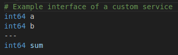
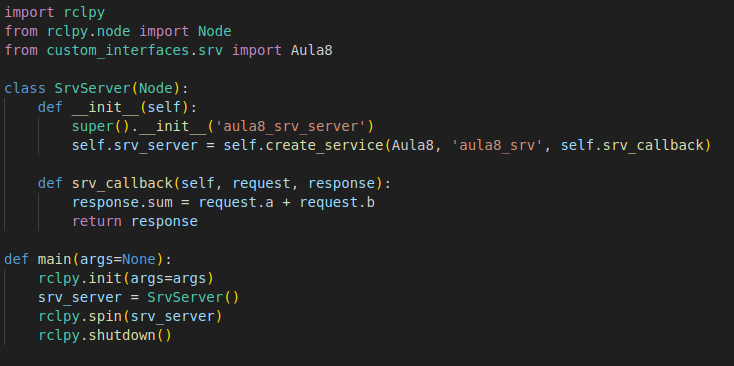
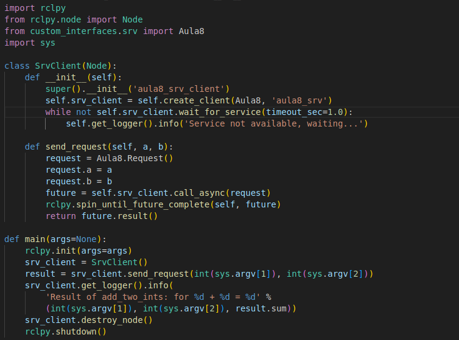

# Services and Clients in ROS2

This guide will guide you in creating a service (server and client) in ROS2 using Python and a custom service interface. Follow each step carefully to understand how services work in ROS2.

## 1. Create a workspace 

1. Choose a directory on your machine to create your workspace. In the example, we will use ~/aula8_ws, but you can use another if you prefer.

2. In the terminal, create the directory and the src folder inside it:

    ```bash
    mkdir -p ~/aula8_ws/src
    cd ~/aula8_ws
    ```

- In ROS2, the concept of **workspace** is used to organize packages and compile the code using ```colcon build```.

- The ```src``` folder is the default directory where ROS2 packages should be placed inside the **workspace**.


## 2. Copy the structure of the ```custom_interfaces``` package

In the file ```.zip``` of the lesson, you will find the ```custom interfaces``` package. This package will be responsible for defining and grouping the custom interfaces that you need for this exercise. It has the following structure:

```css
    custom_interfaces
    ├── package.xml
    ├── CMakeLists.txt
    └── srv
        └── (folder for .srv files)
```

In it, the files ```CMakeLists.txt``` and ```package.xml``` already have the dependencies configured for the installation of custom interfaces for ROS2. In the ```srv``` directory, the custom service interfaces, which have the extension ```.srv```, will be placed.

1. Copy the ```custom_interfaces``` package provided to inside ```~/aula8_ws/src```. At the end, the structure of your workspace should look like this:

    ```css
    ros2_ws
    └── src
        ├── custom_interfaces
        │   ├── package.xml
        │   ├── CMakeLists.txt
        │   └── srv
        │       └── ...
    ```

## 3. Create a custom service interface

1. Inside the ```srv``` directory of the ```custom_interfaces``` package, create a file called ```Aula8.srv```
    - Normally, the names of interfaces are written together, with the first letter of each name in uppercase and ending with the extension of the interface type, for example: ```CustomService.srv```

2. Add the following content to the file:

    

    The interface of a service is divided as follows:
    - **Request**: Composed of the first values to be declared, one per line. Each value is declared by its type, followed by its name.

    - **Separator**: Responsible for separating, in the interface, which values are part of the request and which are part of the response. The format is three hyphens followed by: ```---```

    - **Response**: Composed of the values defined after the separator.

    In this case, the service will receive two integers ```a``` and ```b```. The response will also be an integer ```sum```.

3. In the file ```CMakeLists.txt```, declare the newly created interface to be installed:

    ```bash
    rosidl_generate_interfaces(${PROJECT_NAME}
        "srv/Aula8.srv"
    )
    ```

## 4. Compile the ```custom_interfaces``` package

Now we will compile the workspace so that ROS2 generates the definitions of this new service interface.

1. In the terminal, inside ```~/aula8_ws```, execute:

    ```bash
    colcon build
    ```

2. Then, update the environment:

    ```bash
    source install/setup.bash
    ```

3. Check if the interface is available. In the terminal, execute:

    ```bash
    ros2 interface list
    ```

    And see if the new interface created is among the available ones

    Now, see if the interface corresponds to the one created:

    ```bash
    ros2 interface show custom_interfaces/srv/Aula8
    ```

## 5. Create a new Python package

We will create a new **python** ROS2 package, inside the ```~/aula8_ws/src``` directory, to create the nodes for this lesson. 

1. In the terminal, type:

```bash
cd ~/aula8_ws/src
ros2 pkg create aula8 --build-type ament_python --dependencies rclpy custom_interfaces
```

This command will create a new package called ```aula8```. The argument ```--build-type ament_python``` will define the structure of the package as python. The argument ```--dependencies rclpy custom_interfaces``` will automatically add the indicated dependencies to the ```package.xml``` file.

2. The created package must contain the following structure:

    ```css
    aula8
    ├── package.xml
    ├── setup.py
    ├── resource
    │   └── aula8
    ├── setup.cfg
    └── aula8
        ├── __init__.py
    ````

The nodes will be created in the package's homonymous directory, in this case ```aula8/aula8```.

## 6. Create the node of a service server in ROS2

We will create a Python script that will act as a service server. It will be "listening" for service calls and processing the requests.

1. Inside the ```aula8/aula8/``` directory, create a file called ```srv_server.py``` with the following content: 

    

### Explanation of the code

**1. Imports**

- ```import rclpy``` and ```from rclpy.node import Node```: Import the main ROS2 libraries in Python.

- ```from custom_interfaces.srv import Aula8```: Import our service interface, which contains the definitions of the request and response fields.

**2. Class ```SrvServer```**

- ```class SrvServer(Node)```: Declare a class that inherits from ```Node```, which is the basic structure for any node in ROS2. When initializing, call the constructor of ```Node``` passing ```aula8_srv_server``` as the node name.

- ```self.srv_server = self.create_service(Aula8, 'aula8_srv', self.srv_callback)```: Create a service server:
    - **Service type**: ```Aula8```.

    - **Service name**: ```'aula8_srv'```.

    - **Callback**: ```self.srv_callback```, function responsible for handling the service requests that arrive.

**3. Callback ```srv_callback```**

- ```def srv_callback(self, request, response):```: This function is executed every time someone calls the service ```'aula8_srv'```.

- ```request.a``` and ```request.b``` are the integer values sent by the client.

- ```response.sum = request.a + request.b```: We define the value of ```sum``` to be the sum of the received values.

- ```return response```: Return the response with the ```sum``` field filled.

**4. Main function ```main```**

- ```rclpy.init(args=args)```: Initialize the ROS2 communication system in Python.

- ```srv_server = SrvServer()```: Create the node.

- ```rclpy.spin(srv_server)```: Keep the node running, listening and processing service requests until it is interrupted (for example, with ```Ctrl+C```).

- ```rclpy.shutdown()```: Cleanly finalize the ROS2 after the spin is interrupted.

In summary, this **service server** stays "listening" to the service topic ```aula8_srv```. When a client sends a request (with two values ```a``` and ```b```), the server will call the callback function, process the request (in this case, sum) and send the response (```response.sum```).

## 7. Run the Service Server (service server)

1. Before running, edit the ```setup.py``` file inside ```aula8```, to register this script as executable. Add in entry_points:

    ```python
    entry_points={
        'console_scripts': [
            'srv_server = aula8.srv_server:main',
        ],
    },
    ```

    This step is necessary whenever a new node is created. The command is structured as follows:
        
     - ```srv_server```: Name that will be used to execute the script

     - ```aula8```: Name of the package

     - ```srv_server```: Name of the python script to be registered

     - ```:main```: Function of the script that will be executed

2. In a terminal, go back to the root directory of the workspace ```~/aula8_ws```, compile again and update the environment:

    ```bash
    colcon build
    source install/setup.bash
    ```

3. Now, execute the service

    ```bash
    ros2 run aula8 srv_server
    ````

## 8. Verify if the service server is running by terminal

1. In a new terminal, without interrupting the previous one, update the environment with ```source install/setup.bash```

2. List the available services

    ```bash
    ros2 service list
    ``` 

    You should see ```/aula8_srv``` among the listed services

3. List the active nodes:

    ```bash
    ros2 node list
    ```

    You should see ```/aula8_srv_server``` among the listed nodes

With these last steps, it is possible to verify the existence of the service, with the correct interface, and that the node is running

### 9. Make a call to the service by terminal

Without needing to create a client in Python, we can call the service directly from the terminal using the ```ros2 service call``` command.

1. In the same terminal where you are not running the server (or open a third terminal):

    ```bash
    ros2 service call /aula8_srv custom_interfaces/srv/Aula8 "{a: 2, b: 3}"
    ```

2. In the terminal where you entered the command, you will see:

    ```bash 
    response:
    custom_interfaces.srv.Aula8_Response(sum=5)
    ```

    ```ros2 service call [service] [interface] [request]``` is a command line tool to send service requests without needing to write the client code. It is a simple way to verify if the server works.

## 10. Create a service client (service client) in ROS2

Now that we have verified that the server works, we will create a **client** in Python that sends the request to our server.

1. In the ```aula8/aula8``` directory, create a file called ```srv_client.py``` and copy the following code.



### Explanation of the code

**1. Imports**

- ```import rclpy``` and ```from rclpy.node import Node```: Import the main ROS2 libraries in Python.

- ```from custom_interfaces.srv import Aula8```: Import our service interface, which contains the definitions of the request and response fields.

- ```import sys```: Used to read command line parameters (in this case, ```sys.argv```).

**2. Class ```SrvClient```**

- ```class SrvClient(Node)```: Declare a class that inherits from ```Node```, which is the basic structure for any node in ROS2. When initializing, call the constructor of ```Node``` passing ```aula8_srv_client``` as the node name.

- ```self.srv_client = self.create_client(Aula8, 'aula8_srv')```: Create a service client:
    - **Service type**: ```Aula8```.

    - **Service name**: ```'aula8_srv'```.

- The loop ```while not self.srv_client.wait_for_service(timeout_sec=1.0): ...``` checks if the service server is available, repeating messages of waiting every 1 second until the **service server** is found.

**3. Method ```send_request```**

- ```def send_request(self, a, b)```: define the function that will send the request to the server.

- ```request = Aula8.Request()```: creates an object with the request information from our ```Aula8``` interface.

- ```request.a = a``` and ```request.b = b```: populates the fields a and b of the service interface, which we will receive as input from the terminal.

- ```future = self.srv_client.call_async(request)```: sends the request asynchronously. This returns a future object that will represent the result of the service call.

- ```rclpy.spin_until_future_complete(self, future)```: keeps the node listening for events until the future is completed. When completed, we get the server's response.

- ```return future.result()```: returns the server's response object, which contains the ```sum``` attribute.

**4. Main function ```main```**

- ```rclpy.init(args=args)```: Initializes the ROS2 communication system in Python.

- ```srv_client = SrvClient()```: Creates and instance of the node.

- ```result = srv_client.send_request(int(sys.argv[1]), int(sys.argv[2]))```: calls the ```send_request``` method passing the two parameters defined in the command line (for example, 2 and 3).
    - These parameters are converted to integers using ```int(sys.argv[1])``` and ```int(sys.argv[2])```.

- ```srv_client.get_logger().info(...)```: prints in the log the result received from the server, which is ```result.sum```.

- ```srv_client.destroy_node()``` and ```rclpy.shutdown()```: closes the node and shuts down the ROS2.

In summary, this client connects to the service called ```aula8_srv```, sends two integers as a request and waits for the response (the sum). If the service is not available immediately, it will wait until the server is running.

## 11. Run the Service Client (service client)

1. See if any terminal is executing any node, if so, interrupt it.

2. As with the server, add this node as executable in the ```setup.py``` file:

    ```python 
    entry_points={
        'console_scripts': [
            'srv_server = aula8.srv_server:main',
            'srv_client = aula8.srv_client:main',
        ],
    },
    ```
3. In a terminal, go back to the root directory of the workspace ```~/aula8_ws```, compile again and update the environment:

    ```bash
    colcon build
    source install/setup.bash
    ```

4. Now, execute the service

    ```bash
    ros2 run aula8 srv_client a b
    ````

    Substituting the arguments **a** and **b** with the numbers you want to sum.

    You should see something like:

    ```bash
    [aula8_srv_client]: Service not available, waiting...
    ```

## 12. Run the server in another terminal

1. Open another terminal and run the **server** again:

    ```bash
    ros2 run aula8 srv_server
    ```

2. As soon as the server starts, the client (in the other terminal) should detect the service and send the request.

3. In the client's terminal, you should see something like:

    ```bash
    [aula8_srv_client]: Result of add_two_ints: for 1 + 2 = 3
    ```

## Fixation exercise

### General objective

Create a service server that, when receiving a simple request, returns current robot data — for example, the current pose (position and orientation) and the smallest distance detected by the LIDAR at that instant.

### Suggested steps:

1. Create a custom service interface, whose response contains at least the following information:

    - x position
    - y position
    - robot orientation
    - smallest distance measured by the LIDAR

    **Note**: In the interface, the request can be empty. If you want, you can add other information to the response, such as velocities or IMU information.

2. Create a service server (service server) that subscribes to the relevant topics and, when receiving a request, returns the current information.

3. Create a service client (service client) that requests the current robot information from the server and, when receiving the response, prints it in the terminal

### Tests

1. In a first terminal, execute the robot simulation. It should already leave the information of the sensors available on the topics

2. In a second terminal, execute the server, which should be waiting for a request.

3. In a third terminal, make the client call and see if it executes correctly.

4. To verify if the information received by the client is correct, you can use the ```ros2 topic echo``` command and see the requested information directly from the topic (if the robot is static).

## Conclusion

In this lesson, you created and tested a service in ROS2 from scratch:

1. Defined a custom interface package (custom_interfaces) and compiled to generate the interface.

2. Created a Python package (aula8) that contains the server (server) and client (client) code.

3. Executed and validated the communication between them.

These concepts are fundamental in mobile robotics to request processes in a synchronous way, such as calculations, decision making, or navigation services within a robot.
