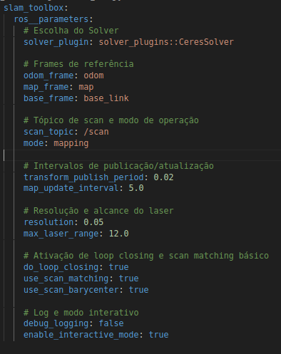
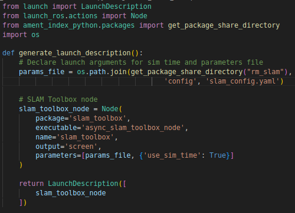
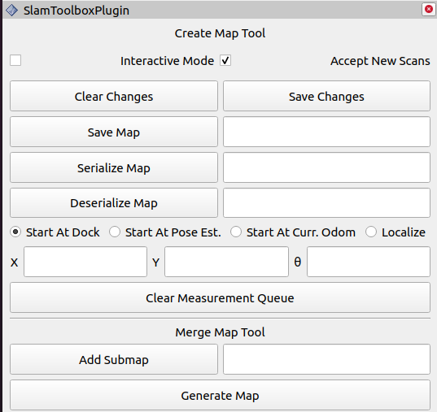

# SLAM (Simultaneous Localization and Mapping) in ROS2

The **slam_toolbox** package is a SLAM (Simultaneous Localization and Mapping) solution for ROS2 that allows incremental map building and updating while localizing the robot. It combines measurements from sensors such as Lidar and odometry, continuously adjusting the estimated pose using advanced techniques. In this way, **slam_toolbox** corrects accumulated errors in odometry and provides accurate localization, being widely used in mobile robot applications for autonomous navigation in known or partially unknown environments.

## 1. Creating the Package

1. In the same workspace as your robot simulation, create the ```rm_slam``` package:

```bash
ros2 pkg create --build-type ament_python rm_slam
```

2. In this package, create the following directories:

- ```launch```: This will contain the ```slam.launch.py``` file, responsible for starting the ```slam_toolbox``` package.

- ```config```: This will contain the ```slam_config.yaml``` file, with the configuration parameters for the ```slam_toolbox``` package.

## 2. Package Configuration File

Just like the algorithms used in the last classes, this package will be configured through a ```.yaml``` file.

1. Inside the ```config``` directory, create the ```slam_config.yaml``` file

2. In the file, copy the following configuration code:



### Essential Parameters

1. **solver_plugin: solver_plugins::CeresSolver**

- Defines the type of optimizer used to adjust poses and close loops.

2. **odom_frame / map_frame / base_frame**

- Specifies the names of the reference frames (odometry, map and robot base), necessary for the transformation system (TF).

3. **scan_topic: /scan**

- Topic from which slam_toolbox gets Lidar or scanning sensor data.

4. **mode: mapping**

- Defines the basic operating mode for map building and refinement.

5. **transform_publish_period: 0.02**

- Frequency (in seconds) of publishing TF transformations for map -> odom (or similar).

6. **map_update_interval: 5.0**

- Interval (in seconds) at which the map is updated with the latest readings.

7. **resolution: 0.05**

- Map resolution in meters per cell (5 cm). Defines the level of detail in the grid.

8. **max_laser_range: 12.0**

- Maximum range (in meters) of laser readings considered in map building.

9. **do_loop_closing: true**

- Enables loop closing. Essential to reduce accumulated errors when revisiting previously mapped areas.

10. **use_scan_matching: true / use_scan_barycenter: true**

- Enables continuous adjustment of scans to improve localization. The barycenter (centroid) helps with matching stability.

11. **debug_logging: false / enable_interactive_mode: true**

- Controls whether debug messages will be displayed and whether interactive mode (editing/manipulating the map in RViz) will be available.


## 3. Launch File

In the ```launch``` directory, write the following **launch** file:



This file will be responsible for initializing the **slam_toolbox** package in ***Online Async*** mode, that is, it will create the map in real time while we navigate (**online**) and will also be able to process data received asynchronously (**async**). As an input parameter, it will receive the file with the configuration parameters.

## 4. Test

1. Compile your workspace and update the environment.

3. In a first terminal, open your simulation.

4. In another terminal, run ```ekf_node``` through the **launch file** created previously.

5. In a third terminal, run the newly created launch file, which should initialize the **slam_toolbox** package.

6. In Rviz, add the visualizations, the map, subscribing to the ```/map``` topic and the visualization of a **MarkerArray**, subscribing to the ```/slam_toolbox/graph_visualization``` topic.

7. Navigate with the robot and, little by little, create the map of your environment.

8. Once complete, save the map. This can be done through a tool from the **rviz** package itself. - In the **rviz** toolbar, click on ```Panels``` and then on ```Add New Panel```.

- Add the ```SlamToolboxPlugin``` panel, which should add the following panel to **rviz**:



- Next to ```Save Map```, name your map and click save. The map files will be saved in the same directory where you started **rviz**.

- After the previous step, two files will be created, with the extensions ```.pgm``` and ```.yaml```. The first is an image containing the created occupancy map, where the black pixels represent occupied areas, the white pixels represent free areas, and the gray pixels represent unknown areas. The second will contain information about this map, such as its resolution and its origin.

9. Now, go back to the previous lesson and reconfigure the path (***path*** ) indicated for using the map with the **AMCL** package. Follow the steps from the previous lesson to run this package and see if your robot is able to locate itself on the newly created map.